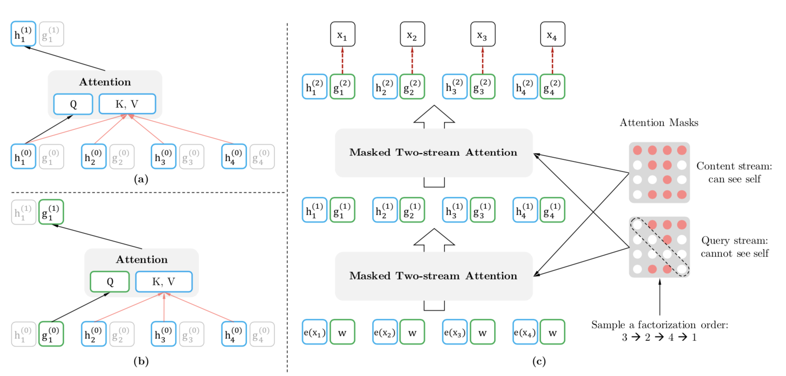

* TOC
{:toc}

## Introduction
* Unsupervised representation learning has been successful in natural language processing.
* **Autoregressive (AR) language modeling** and **autoencoding (AE)** are the most successful unsupervised pretraining objectives

### AR language modeling
* estimate the probability distribution of a text corpus with an autoregressive model
* Given a text sequence $$x = (x_1, \dots, x_T)$$, the likelihood is factorized into a forward product $$p(x) = \prod_{t=1}^T p(x_t \vert x_{<t})$$ or a backward one $$p(x) = \prod_{t=T}^1 p(x_t \vert x_{>t})$$.
* A parametric model (e.g. a neural network) is trained to model each conditional distribution
* only trained to encode a uni-directional context (forward or backward) therefore not effective at modeling deep bidirectional contexts.
* ELMo concatenates forward and backward language models in a shallow manner, which is not sufficient for modeling deep interactions between the two directions.

### AE based pretraining
* does not perform explicit density estimation but aims to reconstruct original data from corrupted input
* e.g. BERT (has been the state-of-the-art approach): certain portion of tokens are replaced by a special symbol `[MASK]` and the model is trained to recover the original tokens
* since density estimation is not part of the objective, BERT is allowed to utilized bidirectional contexts for reconstruction. Results in improved performance compared to AR language modeling
* however, artificial symbols like `[MASK]` are **absent from real data and finetuning time** (while the model sort of expects it), resulting in a **pretrain-finetune discrepancy.**
* moreover, since the predicted tokens are masked, BERT is not able to model the joint probability using the product rule as in AR language modeling. I.e. **BERT assumes that the masked tokens are independent given the unmasked ones**. This is an oversimplification, as high-order, long-range dependency is prevalent in natural language.

XLNet is a generalized autoregressive method that leverages the best of both AR language modeling and AE while avoiding their limitations:
* XLNet maximizes the expected log likelihood of a sequence w.r.t. **all possible permutations of the factorization order**, not only forward or backward factorization. Thanks to the permutation operation, the context for each position consists of tokens from both left and right. In expectation, each position learns to utilize contextual information from all positions (thus it captures bidirectional context).
* XLNet **does not rely on data corruption**. Hence, no pretrain-finetune discrepancy.
* Uses the **product rule for factorizing the joint probability of the predicted tokens, eliminating the independence assumption** made in BERT
* integrates the **segment recurrence mechanism and relative encoding scheme of Transformer-XL** (improves performance for tasks involving longer text sequences)

## Proposed method
### Background
Given a text sequence $$x = [x_1, \dots, x_T]$$, AR language modeling performs pretraining by  **maximizing the likelihood under the forward autoregressive factorization**:

$$\max_\theta \log p_\theta(x)=\sum_{t=1}^T \log p_\theta (x_t\vert x_{<t})=\sum_{t=1}^T \log \frac{\exp (h_\theta(x_{1:t-1})^\top e(x_t))}{\sum_{x'}\exp(h_\theta(x_{1:t-1})^\top e(x')))}$$

where $$h_\theta(x_{1:t-1})$$ is a context representation produced by neural models such as RNNs or Transformers and $$e(x)$$ denotes the embedding of $$x$$.

In comparison, BERT is based on denoising auto-encoding. Given $$x$$, BERT constructs a corrupted version $$\hat{x}$$ by randomly setting a portion of tokens to a special symbol `[MASK]`. Let the masked tokens be $$\bar{x}$$. The training objective is to reconstruct $$\bar{x}$$ from $$\hat{x}$$.

$$\max_\theta \log p_\theta (\bar{x}\vert \hat{x})\approx \sum_{t=1}^T m_t \log p_\theta (x_t \vert \hat{x}) = \sum_{t=1}^T m_t \log \frac{\exp(H_\theta (\hat{x})_t^\top e(x_t))}{\sum_{x'}\exp(H_\theta (\hat{x})_t^\top e(x'))}$$

where $$m_t = 1$$ indicates $$x_t$$ is masked and $$H_\theta$$ is a Transformer that maps a length-$$T$$ sequence $$x$$ into a sequence of hidden vectors $$H_\theta (x) = [H_\theta (x)_1, \dots, H_\theta (x)_T]$$

Pros and cons of the two pretraining objectives:
* **Independence assumption**: BERT factorizes the joint conditional probability $$p(\bar{x}\vert \hat{x})$$ based on an independence assumption that all masked tokens $$\bar{x}$$ are separately constructed (hence the $$\approx$$ sign): the total probability of the assignment is the product of the probabilities of individual assignments (they're not conditioned on each other) ($$m_t = 0$$ for non-masked tokens before reconstructing it is trivial)
* **Input noise**: artificial symbols like `[MASK]` used in BERT never occur in downstream tasks, which creates a pretrain-finetune discrepancy.
* **Context dependency**: the AR representation $$h_\theta(x_{1:t-1})$$ is only conditioned on the tokens up to position $$t$$ (left tokens), while the BERT representation $$H_\theta(x)_t$$ has access to the contextual information on both sides.

### Objective: Permutation Language Modeling
Borrowing ideas from orderless NADE.
For a sequence $$x$$ of length $$T$$, there are $$T!$$ different orders to perform a valid autoregressive factorization. Let $$\mathcal{Z}_T$$ be the set of all possible permutations of length $$T$$. The permutation language modeling objective can be expressed as follows:
$$\max_\theta \mathbb{E}_{z\sim\mathcal{Z}_T}\bigg[ \sum_{t=1}^T \log p_\theta (x_{z_t}\vert x_{z_{<t}}) \bigg]$$

In expectation, $$x_t$$ has seen every possible element $$x_i\ne x_t$$ in the sequence (hence capture bidirectional context).\
Moreover, as this objective fits into the AR framework, it avoids the independence assumption and the pretrain-finetune discrepancy.

we only permute the factorization order, not the sequence order. I.e. we **use the original positional encodings** and rely on a proper **attention mask** in Transformers to achieve the desired permutation. This choice is necessary, since the model will only encounter text sequences with the natural order during finetuning.

### Architecture: Two-Stream Self-Attention for Target-Aware Representations

**Naive implementation with the standard Transformer parameterization may not work.** Why? Assume we parameterize the next-token distribution $$p_\theta (X_{z_t}\vert x_{z_{<t}})$$ using the standard Softmax formulation, i.e.

 $$p_\theta (X_{z_t}\vert x_{z_{<t}}) = \frac{\exp (e(x_t)^\top h_\theta(x_{z_{<t}}))}{\sum_{x'}\exp (e(x')^\top h_\theta(x_{z_{<t}}))}$$

where $$h_\theta(x_{z_{<t}})$$ denotes the hidden representation of $$x_{z_{<t}}$$ produced by the shared Transformer network after proper masking. Now, notice that the representation **$$h_\theta(x_{z_{<t}})$$ does not depend on which position it will predict**, i.e., the value of $$z_t$$. Consequently, the **same distribution is predicted regardless of the target position**, which is not able to learn useful representations.

Why? Let's  consider two different permutations $$z^{(1)}$$ and $$z^{(2)}$$ satisfying: $$z^{(1)}_{<t} = z^{(2)}_{<t}=z_{<t}$$ but $$z^{(1)}_t = i \ne j = z^{(2))}_t$$. Then:

$$p_\theta (X_i = x\vert x_{z_{<t}}) = p_\theta (X_j = x\vert x_{z_{<t}}) = \frac{\exp (e(x)^\top h_\theta(x_{z_{<t}}))}{\sum_{x'}\exp (e(x')^\top h_\theta(x_{z_{<t}}))}$$

Effectively, two different target positions $$i$$ and $$j$$ share exactly the same model prediction.

Therefore, we re-parameterize the next-token distribution to be **target position aware**:

$$p_\theta (X_{z_t} = x\vert x_{z_{<t}}) = \frac{\exp (e(x)^\top g_\theta(x_{z_{<t}}, z_t))}{\sum_{x'}\exp (e(x')^\top g_\theta(x_{z_{<t}}, z_t))}$$

where $$g_\theta(x_{z_{<t}}, z_t)$$ is a type of representations that **also takes the target position $$z_t$$ as input.**

Two sets of hidden representation instead of one:
* **content representation** $$h_\theta(x_{z_{\leq t}})$$ (abbr. $$h_{z_t}$$) serves the role of the standard hidden states in Transformer. Encodes *both* the context and $$x_{z_t}$$ itself. Initialized to the corresponding word embedding, i.e. $$h_i^{(0)} = e(x_i)$$
* **query representation** $$g_\theta (x_{z_{<t}}, z_t)$$ (abbr. $$g_{z_t}$$) only has access to contextual information $$x_{z_{<t}}$$ and the position $$z_t$$ but not the content $$x_{z_t}$$. Initialized with trainable vector, i.e. $$g_i^{(0)} = w$$.

*Note*: the standard self-attention in the Transformer is allowed to have access to the content of the position it is trying to predict, because in the encoder-decoder architecture (as opposed to language modeling), we are trying to predict the content of the target sequence, not the source sequence (thus, the target value of a certain position might depend on the source value at this position too).

*a)*: content stream attention (same as standard self-attention)\
*b)*: query stream attention (does not hav access to information about the content $$x_{z_t}$$)\
*c)*: permutation language modeling training with two-stream two_stream_self_attention

For each self-attention layer $$m=1, \dots, M$$, the two streams of representations are updated with a shared set of parameters as follows:

$$g_{z_t}^{m} \leftarrow \text{Attention}(Q=g_{z_t}^{(m-1)}, KV = h_{z_{\leq t}}^{(m-1)}; \theta)$$
$$h_{z_t}^{m} \leftarrow \text{Attention}(Q=h_{z_t}^{(m-1)}, KV = h_{z_{\leq t}}^{(m-1)}; \theta)$$

The reason we need the content stream attention is because for positions $$j < t$$, we need to encode the context $$x_j$$ (which should be allowed to attend itself, i.e. not mask the diagonal).

*Note*: implementation details such as multi-head attention, residual connection, layer normalization and position-wise feed-forward as used in Transformer(-XL) are omitted. Refer to appendix A.2 in the original paper.

Finally, we can use the last-layer query representation $$g_{z_t}^{M}$$ to compute the next-token distribution.

*Question*: masking the attention matrix to fit a particular permutation of the input sequence, over all permutations; doesn't it amount to NOT masking the attention matrix at all? By not masking, one token would be able to get attention from all other tokens in the sequence, as opposed to the ones that fit the permuation order (albeit taken over all permutations).

#### Partial Prediction
Permutation causes slow convergence. To reduce the optimization difficulty, we choose to only predict the last tokens in a factorization order. Formally, we split $$z$$ into a non-target subsequence $$z_{\leq c}$$ and a target subsequence $$z_{>c}$$ where $$c$$ is the cutting point. The objective is to maximize the log-likelihood of the target subsequence conditioned on the non-target subsequence, i.e.:

$$\max_\theta \mathbb{E}_{z\sim\mathcal{Z}_T} \big[ \log p_\theta (x_{z_{>c}} \vert x_{z_{\leq c}}) \big] = \mathbb{E}_{z\sim\mathcal{Z}_T} \bigg[ \sum_{t=c+1}^{\lvert z \rvert}\log p_\theta (x_{z_t} \vert x_{z_{\leq t}}) \bigg]$$

A hyperparameter $$K$$ is used such that about $$1/K$$ tokens are selected for predictions, i.e. $$\lvert z \rvert / (\lvert z \rvert - c) \approx K$$. For unselected tokens, their query representations need not be computed, which saves speed and memory.

### Incorporating Ideas from Transformer-XL
Transformer-XL is the state-of-the-art AR language model. We integrate **relative positional encoding** (straightforward) and **segment recurrence mechanism**, which we discuss now.

Without loss of generality, suppose we have two segments taken from a long sequence $$s$$; i.e. $$\tilde{x} = s_{1:T}$$ and $$x=s_{T+1:2T}$$ with permutations $$\tilde{z}$$ and $$z$$ respectively. We process the first segment based on permutation $$\tilde{z}$$ and cache the obtained content representations $$\tilde{h}^{(m)}$$ for each layer $$m$$. Then for the next segment $$x$$, the attention updae with memory can be written as:

$$h_{z_t}^{(m)}\leftarrow \text{Attention}(Q=h_{z_t}^{(m-1)}, KV=\underbrace{\big[ \tilde{h}^{(m-1)}, h_{z_{\leq t}}^{(m-1)} \big]}_{\text{concatenation}}; \theta)$$

Positional encodings only depend on the actual positions in the original sequence. Thus, the above attention update is independent of $$\tilde{z}$$ once the representations $$\tilde{h}^{(m)}$$ are obtained. In expectation, the model learns to utilize the memory over all factorization orders of the last segment. Query stream can be computed in the same way.

### Modeling Multiple Segments
Many downstream tasks have multiple input segments, e.g. a question and a context paragraph in question answering. During the pretraining phase, following BERT, we randomly sample two segments (either from the same context or not) and treat the concatenation of two segments as one sequence to perform permutation language modeling. The input is: `[CLS, A, SEP, B, SEP]` (where `SEP` and `CLS` are two special symbols, and `A` and `B` are the two segments).

However, XLNet **does not use the objective of next sentence prediction**.

#### Relative Segment Encoding (on top of relative positional encoding)
BERT adds an absolute segment embedding to the word embedding at each position.
We extend the idea of relative encoding from Transformer-XL to also encode segments. Given a pair of positions $$i$$ and $$j$$ in the sequence. If $$i$$ and $$j$$ are from the same segment, we use a segment encoding $$s_{ij} = s_+$$ or otherwise $$s_{ij} = s_-$$ where $$s_+$$ and $$s_-$$ are learnable model parameters for each attention head. I.e. **we only consider whether two positions are within the same segment, as opposed to considering which specific segment they are from**. When $$i$$ attends to $$j$$, the segment encoding $$s_ij$$ is used to compute an attention weight $$a_{ij} = (q_i + b)^\top s_ij$$ where $$q_i$$ is the query vector as in a standard attention operation, $$b$$ a learnable head-specific bias vector. $$a_{ij}$$ is then added to the normal attention weight.

Benefits or using relative segment encodings:
* inductive bias of relative encodings improves generalization
* opens the possibility of finetuning on tasks that have more than two input segments (not possible using absolute segment encodings)

### Experiments
**Comparison with BERT**

XLNet outperforms BERT by a sizable margin on a wide spectrum of problems including GLUE language understanding tasks, reading comprehension tasks like SQuAD and RACE, text classification tasks such as Yelp and IMDB, and the ClueWeb09-B document ranking task.

Some attention patterns **appear only in XLNet**. They involve the *relative* positions rather than the absolute ones and are likely enabled by the "relative attention" mechanism in XLNet (see appendix A.6)

**Comparison with RoBERTa**

XLNet outperforms RoBERTa on reading comprehension and document ranking (**RACE**), question answering (**SQuAD2.0**), text classification (**IMDB**, **Yelp**, ...) and natural language understanding (**GLUE**).

#### Ablation Study
* effectiveness ot he permutation language modeling alone (compared to denoising auto-encoding objective used by BERT)
* importance of using Transformer-XL as the backbone
* necessity of some implementation details including span-based prediction; bidirectional input pipeline, and next-sentence prediction
