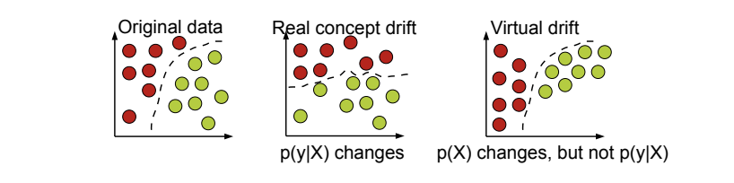

* TOC
{:toc}

## Types
Four types of drift:
* **concept drift**: change in $$P(y\vert x)$$, shift in relationship between input and *target* output. If we have real-time ground truth labels, change in performance is the strongest indicator
* **prediction drift**: change in $$P(\hat{y}\vert x)$$
* **label drift**: change in $$P(y)$$, shift in ground truth distribution
* **feature drift**: change in $$P(X)$$

"Virtual concept drift" has no influence on performance:

## Causes
* **externalities** cause real change in data distribution
* **data integrity issues** due to data engineering or data collection

## How to detect data drift?

No ground truth during inference, therefore cannot use performance metrics like AUC, precision, recall, etc...

### Population Stability Index (PSI)
Mostly used in the financial industry

One training population and one scoring population. Divide each in say $$n$$ equal buckets, denoted $$\{B_1^\mathcal{D}, \dots, B_n^\mathcal{D}\}$$ where $$\mathcal{D}$$ is either the training or scoring dataset. For bucket $$i$$, let's denote $$P_i^t$$ the percentage of training data in bucket $$B_i^\text{training}$$ and $$P_i^s$$ the percentage of training data in bucket $$B_i^\text{scoring}$$.

$$\text{PSI} = \sum_{1 \leq i \leq n} (P_i^s - P_i^t)\cdot \ln \frac{P_i^s}{P_i^t}$$

* PSI < 0.1: no significant population change
* 0.1 < PSI < 0.2: slight population change
* PSI >= 0.2: significant population change

### Kullback-Leibler divergence
Average number of bits wasted by encodings events from $$P$$ based on $$Q$$.
$$D_{KL}(P\Vert Q) = \sum_{x\in \chi} P(x) \log \frac{P(x)}{Q(x)}$$
Standard values?

### Jensen-Shannon divergence
Based on KL divergence, except it is symmetric and always has a finite value

$$JSD(P \Vert Q) = \frac{1}{2}D_{KL}(P\Vert M) + \frac{1}{2}D_{KL}(Q\Vert M), M=\frac{1}{2}(P+Q)$$

### Kolmogorov-Smirnov test
Nonparametric test (does not assume a specific distribution)

Largest absolute difference between two distributions functions:

$$D = \sup_x \lvert F_\text{training}(x) - F_\text{scoring}(x)\rvert$$

where the empirical distribution function for $$n$$ i.i.d. samples is given by:
$$F = \sum_{x} \mathbb{I}_{X_i \in (\infty, x]}$$

If the scoring distribution comes from the reference distribution: $$D \to 0$$ almost surely as $$n\to \infty$$

Recall: sequence $$X_n$$ converges almost surely towards $$X$$ if $$P(\lim_{n\to \infty} X_n = X) = 1$$

## Frameworks
[scikit-multiflow](https://scikit-multiflow.readthedocs.io/en/stable/index.html) for streaming data.

## Papers to read
* https://arxiv.org/pdf/1010.4784.pdf
* https://citeseerx.ist.psu.edu/viewdoc/download?doi=10.1.1.144.2279&rep=rep1&type=pdf
* https://link.springer.com/chapter/10.1007/978-3-540-28645-5_29
