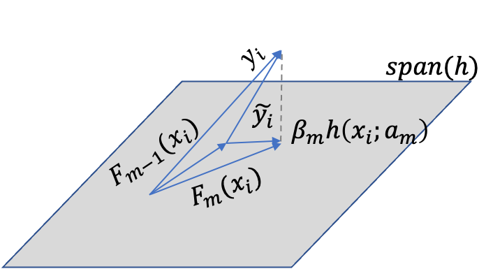

* TOC
{:toc}

## 1. Function estimation
Given training sample $$\{y_i, x_i\}_1^N$$, the goal is to obtain approximation $$\hat{F}$$ of the function $$F^*: x\rightarrow y$$ that minimizes the expected value of some loss function $$L(y, F(x))$$ over the joint distribution of all $$(y, x)$$ values.

$$F^* = \arg \min_F E_{y,x} L(y, F(x)) = \arg \min_F E_x [E_y(L(y, F(x)))\vert x]$$

Frequently employed loss functions:
* squared-error $$(y-F)^2$$ (regression)
* absolute error $$\lvert y - F\rvert$$ (regression)
* negative binomial log-likelihood $$\log (1 + e^{-2yF})$$ (classification, $$y\in\{-1, 1\}$$)

Common procedure is to restrict $$F$$ to be a member of a parameterized class of functions $$F(x; P)$$ where $$P=\{P_1, P_2, \dots\}$$ is a finite set of parameters.

In this paper, we focus on "additive" expansions of the form:

$$F(x; \{\beta_m, a_m\}_1^M) = \sum_{m=1}^M \beta_m h(x; a_m)$$

Generic function $$h(x; a)$$ is a simple function of the input variables, parameterized by $$a = \{a_1, a_2, \dots\}$$

Such expansions are at the heart of many function approximation methods such as neural networks, radical basis functions, MARS, wavelets and support vector machines.

In this paper, each of the functions $$h(x; a_m)$$ is a small regression tree. The parameters $$a_m$$ are the splitting variables, split locations, and the terminal node means of the individual trees.

### 1.1 Numerical optimization
Choosing a parameterized model changes the function optimization problem to one of parameter optimization: $$P^* = \arg \min_P E_{y,x}L(y, F(x;P))$$
The solution for the parameters is expressed in the form: $$P^* = \sum_{m=0}^M p_m$$ where $$p_0$$ is an initial guess and $$\{p_m\}_1^M$$ are successive increments.

### 1.2 Steepest-descent
If we denote $$\Phi(P) = E_{y,x}L(y, F(x;P))$$ and $$g_m = \bigg[ \frac{\partial \Phi(P)}{\partial P_j} \bigg]_{P = P_{m-1}}$$

The step is taken to be $$p_m = -\rho_m g_m$$ where we perform **line search** $$\rho_m = \arg \min_\rho \Phi(P_{m-1} - \rho g_m)$$ along the steepest descent defined by negative gradient $$-g_m$$.

## 2. Numerical optimization in function space
Non-parametric approach: we consider $$F(x)$$ evaluated at each point $$x$$ to be a parameter and seek to minimize:
$$\Phi(F)=E_{y,x}L(y, F(x)) = E_x[E_y(L(y, F(x)))\vert x]$$

In function space, there are an infinite number of such parameters, but in data sets, only a finite number $$\{ F(x_i) \}_1^N$$. Following, the numerical optimization:
$$F^*(x)=\sum_{m=0}^M f_m(x)$$

where $$f_0$$ is an initial guess and $$f_m$$ are incremental functions.
For steepest descent: $$f_m(x) = -\rho_m g_m(x)$$ with:

$$g_m(x) = \bigg[ \frac{\partial E_y [L(y,F(x))\vert x]}{\partial F(x)} \bigg]_{F(x)=F_{m-1}(x)}$$

Among sufficient regularity that one can interchange differentiation and integration (see [Leibniz Integral rule](https://en.wikipedia.org/wiki/Leibniz_integral_rule)):
$$g_m(x) = E_y \bigg[ \frac{\partial L(y, F(x))}{\partial(F(x))} \bigg]_{F(x) = F_{m-1}(x)}$$

The multiplier $$\rho_m$$ is given by the line search: $$\rho_m = \arg \min_\rho E_{y,x}L(y,F_{m-1}(x)-\rho g_m(x))$$

## 3. Finite data
For a finite data sample, the expectation cannot be estimated accurately. Moreover, this approach would not ensure that the functions $$f_m$$ are adapted for unseen data points. We impose smoothness on the solution by assuming a parameterized form:

$$F(x; \{\beta_m, a_m\}_1^M) = \sum_{m=1}^M \beta_m h(x; a_m)$$

and minimize the data based estimate of expected loss:

$$\{\beta_m, a_m\} = \arg \min_{\{\beta_m', a_m'\}_1^M} \sum_{i=1}^N L(y_i, \sum_{m=1}^M \beta_m' h(x_i; a_m'))$$

If infeasible, one can try a **greedy-stagewise** approach. For $$m=1,2, \dots, M$$:

$$(\beta_m, a_m) = \arg \min_{\beta, a} \sum_{i=1}^M L(y_i, F_{m-1}(x_i) + \beta h(x_i; a))$$
and then: $$F_m(x)=F_{m-1}(x) + \beta_m h(x; a_m)$$

Here, we don't readjust previously entered terms as in the *stepwise* approach.

* in signal processing, this stagewise strategy is called **matching pursuit** (squared-error loss). Functions $$h$$ are called **basis functions** and are taken from an over-complete wavelet-like dictionary
* in machine learning, it is called **boosting** and the loss is either the **exponential loss criterion** $$e^{-yF}$$ or the negative binomial log-likelihood. Function $$h$$ is called a **weak learner** or **base learner** and is a classification tree.

Given approximator $$F_{m-1}$$, the function $$\beta_m h(x; a_m)$$ (i.e. after optimizing $$\beta_m, a_m$$) can be viewed the best greedy step towards the estimate of $$F^*$$, **under the constraint that the step direction $$h(x; a_m)$$ be a member of the class of functions $$h(x;a)$$**. It can thus be regarded as a steepest-descent step.

The unconstrained negative gradient:
$$-g_m(x_i) = - \bigg[ \frac{\partial L(y_i, F(x_i))}{\partial F(x_i)} \bigg]_{F(x)=F_{m-1}(x)}$$

gives the best steepest-descent step direction $$-g_m = \{-g_m(x_i)\}_1^N$$ in the $$N$$-dimensional data space at $$F_{m-1}(x)$$.

However, this gradient is only defined at data-points $$x_i$$ and cannot be generalized to other $$x$$. We therefore choose that member of parameterized class $$h(x; a_m)$$ that produces $$h_m = \{x_i, a_m\}_1^N$$ most parallel to $$-g_m$$ (i.e. most highly correlated with it). It can be obtained by solving the least squares problem:
$$a_m = \arg \min_{a, \beta} \sum_{i=1}^N [-g_m(x_i) - \beta h(x_i; a)]^2$$

We then use $$h(x; a_m)$$ as the negative gradient in line-search:
$$\rho_m = \arg \min_\rho \sum_{i=1}^N L(y_i, F_{m-1}(x_i) + \rho h(x_i, a_m))$$
and: $$F_m(x) = F_{m-1}(x) + \rho_m h(x;a_m)$$

### Algorithm: Gradient Boost
$$F_0(x) = \arg\min_\rho \sum_{i=1}^N L(y_i, \rho)$$\
For $$m=1\text{ to }M$$ do:
$$\tilde{y}_i = -\bigg[ \frac{\partial L(y_i, F(x_i))}{\partial F(x_i)} \bigg]_{F(x)=F_{m-1}(x)}, i=1, N$$
$$a_m = \arg\min_{a,\beta} \sum_{i=1}^N [\tilde{y}_i - \beta h(x_i; a)]^2$$
$$\rho_m = \arg \min_\rho \sum L(y_i, F_{m-1}(x_i) + \rho h(x_i; a_m))$$
$$F_m(x) = F_{m-1}(x) + \rho_m h(x; a_m)$$

## 4. Applications: additive modeling
### 4.1. Least-squares regression
$$L(y,F)=(y-F)^2/2$$ thus $$\tilde{y}_i = y_i - F_{m-1}(x_i)$$. Therefore, $$a_m, \beta_m$$ are fitting the residuals and line search produces $$\rho_m = \beta_m$$ (we can thus skip the $$\rho_m$$ optimization step)

(using any base learner $$h$$)

### 4.2 Least-absolute-deviation (LAD) regression.
$$L(y, F) = \lvert y - F \rvert$$ and $$\tilde{y}_i = sign(y_i - F_{m-1}(x_i))$$.
Therefore $$h$$ is fit (by least-squares) to the sign of the current residuals and the line search becomes:
$$\rho_m = \arg \min_{\rho} \sum_{i=1}^N \lvert y_i - F_{m-1}(x_i) - \rho h(x_i; a_m)\rvert$$
$$= \arg\min_\rho \sum \lvert h(x_i; a_m)\rvert \cdot \bigg\lvert \frac{y_i - F_{m-1}(x_i)}{h(x_i; a_m)} - \rho \bigg\rvert$$
$$= \underbrace{\text{median}_W}_{\text{weighted median}} \bigg\{  \frac{y_i - F_{m-1}(x_i)}{h(x_i; a_m)} \bigg\}, w_i = \lvert h(x_i; a_m) \rvert$$
(using any base learner $$h$$)

### 4.3. Regression trees
Base learner is  a $$J$$-terminal node regression tree. Each regression tree model has the additive form:
$$h(x; \{b_j, R_j\}_1^J) = \sum_{j=1}^J b_j 1(x\in R_j)$$
i.e. if $$x\in R_j$$ then $$h(x) = b_j$$. Where the regions $$\{R_j\}_1^J$$ is a partition of $$x$$.

The update becomes:
$$F_m(x) = F_{m-1}(x) + \underbrace{\rho_m \sum_{j=1}^J b_{jm}1(x\in R_{jm})}_{\sum \gamma_{jm}1(x\in R_{jm}), \gamma_{jm} = \rho_m b_{jm}}$$

Where $$\{ R_{jm} \}_1^J$$ are regions defined by the terminal nodes at the $$m$$th iteration. They are constructed to predic the pseudo-responses $$\{\tilde{y}_i\}_1^N$$ by least-squares.

We can view this as **adding $$J$$ separate basis functions at each step**. One can thus improve the quality of the fit by using the optimal coefficients for each of these separate basis functions:

$$\{y_{jm}\}_1^J = \arg \min_{\{\gamma_j\}_1^J} \sum_{i=1}^N L\bigg( y_i, F_{m-1}(x_i) + \sum_{j=1}^J \gamma_j 1(x\in R_{jm}) \bigg)$$

Since the regions are disjoints, this reduces to:
$$\gamma_{jm} = \arg \min_\gamma \sum_{x_i \in R_{jm}} L(y_i, F_{m-1}(x_i) + \gamma)$$

*Note*:\
In case of LAD regression, why not directly minimize: $$tree_m(x) = \arg \min_{\text{J-node }tree} \sum_{i=1}^N \lvert y_i - F_{m-1}(x_i) - tree(x_i)\rvert$$?
Using squared-error loss to search for splits is much faster than mean-absolute-deviation. Why? (see CS289 lecture notes)

### 4.4 M-Regression
Attempts **resistance to long-tailed error distributions and outliers while maintaining high efficiency for normally distributed errors.** Consider the Huber loss function.

$$L(y,F) = \frac{1}{2}(y-F)^2 if \lvert y - F \rvert \leq \delta\text{ and }\delta(\lvert y-F\rvert - \delta/2)\text{ otherwise}$$

The transition point $$\delta$$ defines those residual values that are considered to be outliers, subject to absolute rather than squared error-loss. Common practice is to choose $$\delta$$ to be the $$\alpha$$-quantile of the distribution of $$\lvert y-F^*(x)\rvert$$, where $$(1-\alpha)$$ controls the break-down point (fraction of observations that can be arbitrarily modified without seriously degrading the quality of the result). One can use $$F_{m-1}$$ as an approximation of $$F^*$$:
$$\delta_m = \text{quantile}_\alpha \{\lvert y_i - F_{m-i}(x_i)\rvert\}_1^N$$

With regression trees as base learners, we can do a separate update in each terminal node $$R_{jm}$$ as seen in 4.3.

The solution to each update can be approximated by a single step of the standard iterative procedure (see Huber 1964), starting at the median of residuals:

$$\tilde{r}_{jm} = \text{median}_{x_i\in R_{jm}} \{y_i - F_{m-1}(x_i)\}$$

The approximation is:
$$\gamma_{jm} = \tilde{r}_{jm} + \frac{1}{\lvert R_{jm}\rvert} \sum_{x_i \in R_{jm}} sign(r_{m-1}(x_i) - \tilde{r}_{jm})\cdot \min(\delta_m, abs(r_{m-1}(x_i) - \tilde{r}_{jm}))$$

According to motivations underlying robust regression, this algorithm should have properties:
* **similar to that of least-squares boosting for normally distributed errors**
* **similar to that of least-absolute-deviation regression with very long tailed distributions**
* **superior to both for error distributions with only moderately long tails**

### 4.5 Two-class logistic regression and classification
Loss function is negative binomial log-likelihood: $$L(y,F) = \log(1+\exp(-2F)), y\in\{-1, 1\}$$ where $$F(x)=\frac{1}{2}\log \bigg[ \frac{P(y=1\vert x)}{P(y=-1\vert x)} \bigg]$$ (1/2 log odds).

With regression trees as base learners, we again use separate updates in each terminal node $$R_{jm}$$. There is no closed form solution to the minimization, thus we approximate it by a single Newton-Raphson step (see Friedman, Hastie, Tibshirani *Additive logistic regression: a stistical view of boosting* (2000)):
$$\gamma_{jm} = \sum_{x_i \in R_{jm}} \tilde{y}_i / \sum_{x_i \in R_{jm}} \lvert \tilde{y}_i\rvert(2-\lvert \tilde{y}_i\rvert)$$

The log-odds can be inverted to get the probability estimates, which can be used for classification:
$$\hat{y}_i = 2\cdot \mathbb{I}[c(-1, 1)\hat{P}(y=1\vert x) > c(1,-1)\hat{P}(y=0\vert x)] - 1$$
where $$c(\hat{y}, y)$$ is the cost of predicting $$\hat{y}$$ when the truth is $$y$$.

#### 4.5.1 Influence trimming
Using the binomial log-likelihood, the empirical loss function:
$$\phi_m(\rho, a) = \sum_{i=1}^N L(y_i, F_{m-1}(x_i) + \rho h(x_i; a))$$
$$=\sum_{i=1}^N \log[1 + \exp(-2y_iF_{m-1}(x_i))\cdot\exp(-2y_i\rho h(x_i; a))]$$

If $$y_iF_{m-1}(x_i)$$ is ver large, then $$\rho h(x_i; a)$$ will have almost no influence on the loss. This suggests that all observations $$(y_i, x_i)$$ for which $$y_iF_{m-1}(x_i)$$ is very large can be deleted from all computations of the $$m$$-th iteration.

$$w_i = \exp(-2y_i F_{m-1}(x_i))$$
can be viewed as a measure of the influence of the $$i$$-th iteration on the estimate $$\rho_m h(x_i; a_m)$$

We can also use the second derivative of the loss with respect to $$F$$ as $$w_i$$.

Influence trimming deletes all observations with $$w_i$$-values less than $$w_{l(\alpha)}$$ where $$l(\alpha)$$ is the number of weights arranged in ascending order, whose sum equals $$\alpha$$ times the total sum of weights (typical values are $$\alpha \in [0.05, 0.2]$$).

90% to 95% of the observations are often deleted without sacrificing accuracy. Results in a corresponding reduction in computation by a factor 10 to 20.

### 4.6 Multi-class logistic regression and classification
$$L(\{y_k, F_k(x)\}_1^K) = -\sum_{k=1}^K y_k \log_k p_k (x)$$
where $$y_k = \mathbb{I}[\text{class}=k]\in{0,1}$$ and $$p_k(x) = \mathbb{P}(y_k=1\vert x)$$.

$$p_k(x) = \text{softmax}(F)_k = \exp(F_k(x))\bigg/ \sum_{l=1}^K \exp (F_l (x))$$

Thus, $$K$$-trees with $$J$$-terminal nodes each are induced at each iteration $$m$$ to predict the corresponding current residuals for each class. Since the regions corresponding to different classes overlap, one cannot separate calculation within each region of each tree. Approximate solution with a single Newton-Raphson step using a diagonal approximation to the Hessian decomposes the problem into a separate calculation for each terminal node of each tree:

$$\gamma_{jkm} = \frac{K}{K-1} \frac{\sum_{x_i\in R_{jkm}} \tilde{y}_{ik}}{\sum_{x_i\in R_{jkm}} \lvert \tilde{y}_{ik}\rvert (1- \lvert \tilde{y}_{ik}\rvert)}$$

The final probability estimates at step $$M$$ can be used for classification:
$$\tilde{k}(x) = \arg \min_{1\leq k\leq K} \sum_{k'=1}^K c(k,k') p_{k'M}(x)$$

For $$K=2$$, this algorithm is equivalent to binary logistic regression.
Influence trimming for multi-class is implemented the same way as for two-class.

## 5. Regularization
For additive expansions, a natural regularization is the **number of components $$M$$**. This places an implicit prior belief that "sparse" approximations involving fewer terms are likely to provide better predictions.

However, regularization through shrinkage provides superior results than restricting number of components (Copas 1983).

Simple shrinkage strategy is introducing **learning rate** $$\nu \in (0, 1]$$:
$$F_m(x) = F_{m-1}(x) + \nu \rho_m h(x; a_m)$$

There is a trade off between $$\nu$$ and $$M$$ (decreasing $$\nu$$ increases best value for $$M$$, increasing $$M$$ increases computation time proportionately).

**Misclassification error is not sensitive to over-fitting**: misclassification error-rate decreases well after the logistic likelihood has reached its optimum. Error-rate depends only on the sign of $$F_M(x)$$, whereas the likelihood is affected by both magnitude and sign. **Over-fitting degrades the quality of the estimate without affecting (and sometimes improving) the sign.**

## 7. Tree boosting
* Meta-parameters of the GradientBoost procedure: $$M$$ and $$\nu$$
* Meta-parameter of the base learner: number of terminal nodes $$J$$.

Best choice for $$J$$ depends on the highest order of the dominant interactions among the variables.

Consider "ANOVA" expansion of a function:
$$F(x) = \sum_j f_j(x_j) + \sum_{j,k} f_{jk}(x_j,x_k) + \sum_{j,k,l}f_{jkl}(x_{jkl}) + \dots$$
* first sum is "main effects" component of $$F(x)$$. Reffered to as "additive" model because contributions of each $$x_j$$, $$f_j(x_j)$$ are added. Provides closest approximation to $$F(x)$$. More restrictive definition of "additive" model than the one provided at the beginning.
* second sum: two-variable "interaction effects"
* and so on...

Highest interaction order possible is limited by the number of input variables $$n$$.

Purely additive approximations are also produced by the "naive"-Bayes method.

In boosting regression trees, **the interaction order can be controlled by limiting the size of the individual trees** induced at each iteration:
* a tree with $$J$$ terminal nodes produces a function with interaction order at most $$\min(J-1, n)$$.
* Since boosting is additive, order of the entire approximation can be no larger than the largest among its individual components.
* Best tree size $$J$$ is governed by the effective interaction order of the target $$F^*$$.
* As, this is usually unknown, $$J$$ becomes a meta-parameter to be estimated using a model selection criterion. It is **unlikely that large trees would ever be necessary or desirable**.

## 8. Interpretation
### 8.1 Relative importance of input variables
$$I_j = \bigg(E_x\bigg[ \frac{\partial \hat{F}(x)}{\partial x_j} \bigg]^2 \cdot var_x[x_j]\bigg)^{1/2}$$

Does not strictly exist for piecewise constant approximations produced by decision trees. Breiman et al (1983) propose surrogate measure:
$$\hat{I}^2_j (T) = \sum_{t=1}^{J-1} \hat{i}_t^2 \mathbb{I}(v_t = j)$$
* summation over non-terminal nodes $$t$$ of the $$J$$-terminal node tree $$T$$
* $$v_t$$ is the splitting variable associated with node $$t$$
* $$\hat{i}^2$$ is the empirical improvement in squared error as a result of the split
* For a collection of decision trees $$\{T_m\}_1^M$$: $$\hat{I}^2_j = \frac{1}{M} \sum_{m=1}^M \hat{I}_j^2 (T_m)$$ (generalization justified by heuristic arguments in the paper)

### 8.2 Partial dependence plots
Useful for visualizing functions of high dimensional arguments.
Let $$z_l$$ be a chosen "target" subset of size $$l$$, of the input variables $$x$$:
$$z_l = \{z_1, \dots, z_l\}\subset \{x_1, \dots, x_n\}$$ and $$z_{\setminus l}$$ the complement subset.

One can condition $$\hat{F}(x)$$ on particular values of $$z_{\setminus l}$$ and consider it as a function only of $$z_l$$: $$\hat{F}_{z_{\setminus l}} = \hat{F}(z_l \vert z_{\setminus l})$$

In general $$\hat{F}_{z_{\setminus l}}$$, depends on the particular values chosen for $$z_{\setminus l}$$.

If this dependence is not too strong, the average function:

$$\hat{F}_l(z_l) = E_{z_{\setminus l}}\big[\hat{F}(x)\big]=\int \hat{F}(z_l, z_{\setminus l})p_{\setminus l}(z_{\setminus l})dz_{\setminus l}$$

can represent a useful summary of the "partial dependence" of $$\hat{F}(x)$$ on $$z_l$$.
$$p_{\setminus l}(z_{\setminus l})$$ is the marginal probability density of $$z_{\setminus l}$$:
$$p_{\setminus l}(z_{\setminus l}) = \int \underbrace{p(x)}_{\text{joint density of all inputs }x}dz_l$$

This complement marginal density can be estimated from the training data and finally:

$$\bar{F}_l(z_l)=\frac{1}{N}\sum_{i=1}^N \hat{F}(z_l, z_{i,\setminus l})$$

For regression trees based on single-variable splits, the partial dependence of $$\hat{F})x$$ doesn't need reference to the data to be evaluated. For a specific set of values for $$z_l$$, a weighted traversal is performed. At the root, a weight value of one is assigned. For each non-terminal node visited, if its split variable is in the target subset $$z_l$$, the weight is not modified. If its in the complement subset $$z_{\setminus l}$$, the weight is multiplied by the fraction of observations that went left or right respectively. When the traversal is complete, $$\bar{F}_l(z_l)$$ is the weighted average over the $$\hat{F}(x)$$ values  of the terminal nodes.

When the dependence of $$\hat{F}(x)$$ on $$z_l$$ is additive or multiplicative (i.e. $$\hat{F}(x)=\hat{F}_l(z_l) + \text{ or }\times \hat{F}_{\setminus l}(z_{\setminus l})$$), then $$\bar{F}_l(z_l)$$ provides a complete description of the nature of the variation of $$\hat{F}(x)$$ on the variable subset $$z_l$$.

Therefore, subsets that group together influential inputs that hae complex (nonfactorable) interactions between them will provide the most reveling partial dependence plots.

As a diagnostic, we can compute $$\hat{F}_l(z_l)$$, $$\hat{F}_{\setminus l}(z_{\setminus l})$$ and compute the correlation of their sum/product with $$\hat{F}(x)$$.

Interpretability of larger trees is questionable (too unstable).

## 10. Data Mining
**Gradient Boosting** is robust: it is invariant under all (strictly) monotone transformations of the individual input variables. E.g. using $$x_j, \log x_j, \exp x_j, x_j^a$$ as the $$j$$-th input variable yields the same result. No need for variable transformation. As a consequence, **sensitivity to long tailed distribution and outliers is also eliminated** (why? because you can make the spread between data points arbitrarily small by applying say the log function)

*LAD*- and *M*-regression are especially robust to outliers (absolute loss and Huber loss respectively).

**Feature selection**: trees are robust against the addition of irrelevant input variables. All tree based models handle missing values in a unified and elegant manner (Breiman *et al* 1983) (**WHY?**, because if *None*, the variable is simply not considered for splitting?). No need to consider external imputation schemes.

**Principal disadvantage of single tree models is inaccuracy** due to piecewise-constant approximaions. This is solved by boosting (piecewise-constant approximations but granularity is much finer).
