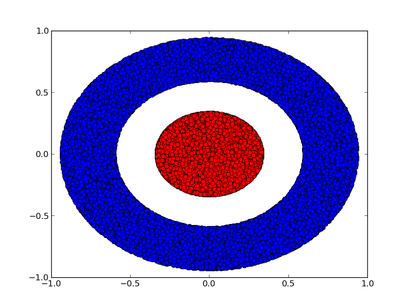
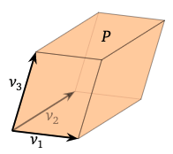
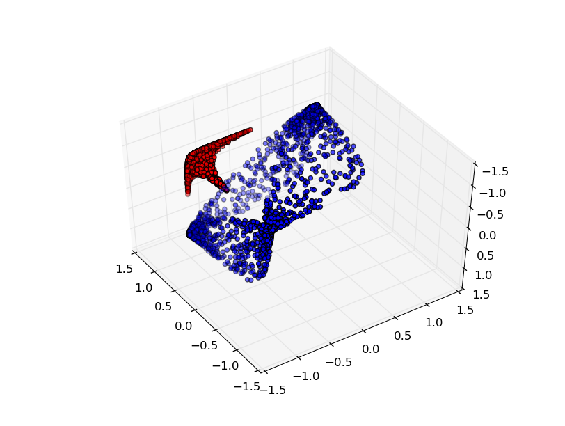
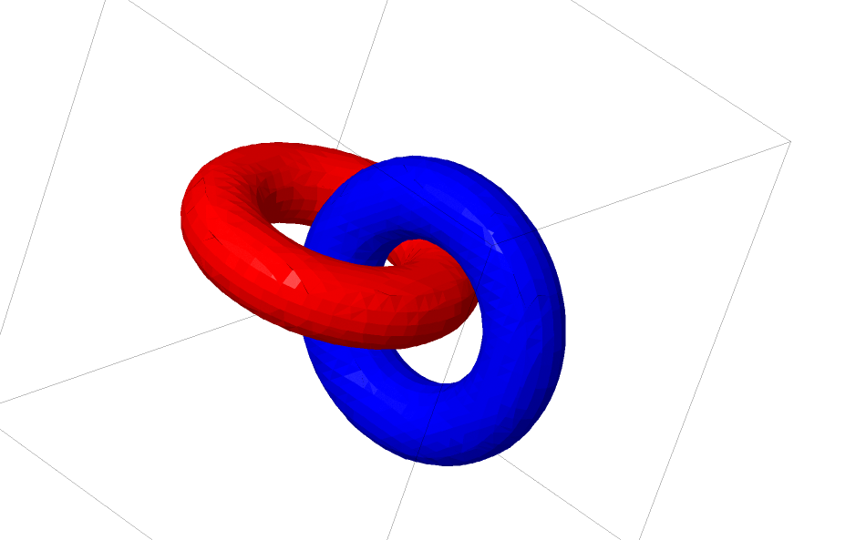
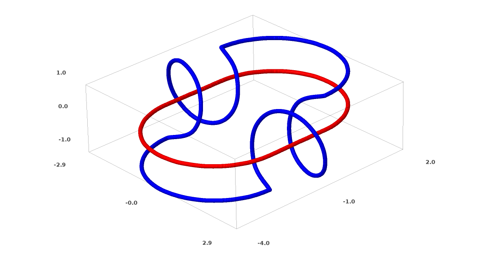

Source: [Colah's blog post](https://colah.github.io/posts/2014-03-NN-Manifolds-Topology/)

Each layer creates a new representation by applying an affine transformation followed by a point-wise application of a monotone activation function.

When doing binary classification for example, the network disentangles the two classes so that they are **linearly separable by a hyperplane in the final representation** (hyperplane = subspace of dimension $$n-1$$ in a $$n$$-dimensional space). The size of the dimensional space is given by the number of parameters in the network (all taken to be orthogonal directions).

Each layer stretches and squishes space but it never cuts, breaks, or folds it. Transformations that preserve **topological properties** are called **homeomorphisms**. They are bijections that are continuous functions both ways.

Why a simple feedforward layer is a homeomorphism:

Layers with $$N$$ inputs and $$N$$ outputs are homeomorphisms if the weight matrix $$W$$ is non-singular (if $$W$$ has rank $$N$$ / non-zero determinant, it is a bijective linear function with linear inverse). Moreover, translations (bias) are homeomorphisms as well as the non-linearity (if we are careful about the domain and range we consider). This is true for sigmoid, tanh and softplus but not ReLU (discontinuity at 0).

## Example: topology and classification
Consider two dimensional dataset with two classes $$A, B \subset \mathbb{R}^2$$.

$$A = \{x \vert d(x, 0)  < 1/3 \}$$
$$B = \{x\vert 2/3 < d(x, 0) < 1 \}$$

**Claim**: it is impossible for a neural network to classify this dataset without having a layer that has 3 or more hidden units, regardless of depth.

**Proof**: either each layer is a homeomorphism or the layer's weight matrix has determinant 0. If it is a homeomorphism, $$A$$ is still surrounded by $$B$$ and a line cannot separate them (if dimension 2 at most). Suppose it has determinant 0: the dataset gets collapsed on some zero volume hyperplane (in 2-dimensional case, an axis). Collapsing on any axis means points from $$A$$ and $$B$$ get mixed and cannot be linearly separated.

Why? Let a parallelepiped in $$\mathbb{R}^n$$ be the set of points $$\mathcal{P} = \{a_1 \vec{x_1} +\dots + a_n \vec{x_n} \vert 0 \leq a_1 \dots a_n \leq 1 \}$$

A parallelepiped has zero volume when it's flat i.e. it is squashed into a **lower** dimension, that is when $$\{\vec{x_1}\dots\vec{x_n}\}$$ are linearly dependent.

Moreover its volume is given by the absolute value of the determinant of the matrix with rows $$\{\vec{x_1}\dots\vec{x_n}\}$$.

See https://textbooks.math.gatech.edu/ila/determinants-volumes.html.

Adding a third hidden unit, the problem becomes trivial:

## The Manifold Hypothesis
Manifold hypothesis is that natural data forms lower-dimensional manifolds in its embedding space. There are theoretical and experimental reasons to believe this is true. Task of a claassification algorithm is fundamentally to **separate tangled manifolds** (for example, separate the "cat" manifold from the "dog" manifold in the space of images $$\in \mathbb{R}^{n\times n}$$).

## Links and homotopy
Consider two linked tori $$A$$ and $$B$$.

Much like the previous dataset, this one cannot be separated without using $$n+1$$ dimensions (i.e. 4 in this case)

**Links** are studied in **knot theory**, an area of topology. Is a link an unlink (i.e. separable by continuous deformation) or not.

Example of an unlink:

An **ambient isotopy** is a procedure for untangling links. Formally, an ambient isotopy between manifolds $$A$$ and $$B$$ is a continuous function $$F: [0,1]\times X\rightarrow Y$$ such that each $$F(t)$$ is a homeomorphism from $$X$$ to its range. $$F(0)$$ is the identity and $$F1$$ maps $$A$$ to $$B$$. $$F$$ continuously transitions from mapping $$A$$ to itself to mapping $$A$$ to $$B$$.

**Theorem**: There is an ambient isotopy between the input and a network layer's representation if:
* a) $$W$$ isn't singular
* b) we are willing to permute the neurons in the hidden layer
* c) there is more than 1 hidden unit

**Proof**:
1. Need $$W$$ to have a positive determinant. We assume it is not zero and can flip the sign if it is negative by switching two hidden neurons (switching two rows of a matrix flips the sign of its determinant). The space of positive determinant matrices is [path-connected](https://en.wikipedia.org/wiki/Connected_space#Path_connectedness) (a path can be drawn between any two points in the space). Therefore we can connect the identity to $$W$$: there exits a path $$p: [0,1]\rightarrow GL_n(\mathbb{R})^5$$ (general linear group of degree $$n$$, set of invertible $$n\times n$$ matrices) such that $$p(0) = Id$$ and $$p(1) = W$$. We can continually transition from the identity function to the $$W$$ transformation with the function $$x \rightarrow p(t)x$$.
2. We can continually transition from the identity function to the $$b$$ translation (bias) with the function $$x \rightarrow x + tb$$.
3. We can continually transition from the identity function to the pointwise use of $$\sigma$$ with the function: $$x \rightarrow (1-t)x + t\sigma(x)$$.

Determining if knots are trivial is NP.
Links and knots are $$1$$-dimensional manifolds but we need 4 dimensions to untangle them. **All $$n$$-dimensional manifolds can be untangled in  $$2n + 2$$ dimensions.**

The natural thing for a neural net to do is to pull the manifolds apart naively and stretch the parts that are tangled as thin as possible (can achieve high classification accuracy). This would present high gradients on the regions it is trying to stretch near-discontinuities. Contractive penalties, penalizing the derivatives of the layers at data points is a way to fight this.

## Next steps
Read MIT's paper: [Testing the Manifold Hypothesis](http://www.mit.edu/~mitter/publications/121_Testing_Manifold.pdf)

http://www.iro.umontreal.ca/~lisa/pointeurs/ICML2011_explicit_invariance.pdf
https://paperswithcode.com/paper/facenet-a-unified-embedding-for-face
