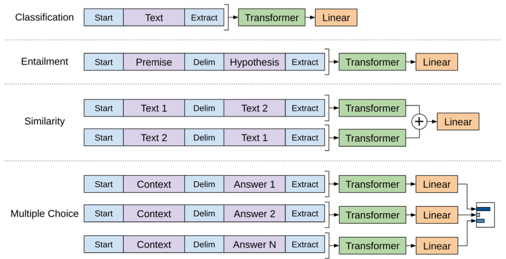

* TOC
{: toc}

## 1. Generative pre-training
Language modeling objective on unlabeled data using auto-regressive model:

$$L_1(\{u_1, \dots, u_n\})=\sum_i \log P(u_i\vert u_{i-k}, \dots, u_{i-1}; \Theta)$$

where $$k$$ is the size of the context window and $$u_i$$s the tokens in the corpus.

*BooksCorpus* dataset is used for training (7,000 unique unpublished books from a variety of genres). It contains long stretches of contiguous text, which allows the generative model to learn to condition on long-range information.

The *1B Word Benchmark* used by ELMo is approximately the same size but is shuffled at a sentence level - destroying long-range structure.

## 2. Discriminative fine-tuning
Task-specific input adaptation and corresponding supervised objective

$$L_2(\mathcal{D}) = \sum_{(x,y)} \log P(y\vert x^1, \dots, x^m)$$

where $$P(y\vert x^1,\dots, x^m) = \text{softmax}(h_l^m W_y)$$. $$h_l^m$$ is the final transformer block's activation and $$W_y$$ is a task-specific parameter learned during fine-tuning.

Including language modeling as **auxiliary objective** to the fine-tuning improves generalization: $$L_3 = L_2 + \lambda L_1$$

Pre-trained model is trained on contiguous sequences of text, thus inputs for fine-tuning tasks need to be adapted to a *traversal-style* approach:

Embeddings for delimiter tokens are parameters that arise during fine-tuning.

## Architecture
* multi-layer *Transformer decoder*
* provides structured memory for handling long-term dependencies than attention-augmented RNNs.

## Results
(improvements are absolute)
* 86.5 / +8.9% on commonsense reasoning (Stories Cloze Test)
* 59 / +5.7% on question answering (RACE)
* 81.4 / +1.5% on textual entailment (MultiNLI) (judge relationship as entailment, contradiction or neutral)
* 72.8 / +5.5% on GLUE multi-task benchmark

Larger fine-tuning datasets benefit from the language model auxiliary objective but smaller datasets do not.

Transformers beats LSTM-based architectures on almost all datasets.

## Notes
* Zero-shot behavior: perform task without supervised fine-tuning
* earliest approaches used unlabeled data to compute word-level or phrase-level statistics, then used as a feature in a supervised model before adopting to word embeddings
* used *ftfy* library to fix unicode that's broken and *spaCy* tokenizer
* Mathews correlation coefficient: measure of the quality of binary classification. Computed using confusion matrix, regarded as balanced measure which can be used even in the case of class imbalance (better than F1 score). See [wikipedia](https://en.wikipedia.org/wiki/Matthews_correlation_coefficient).
