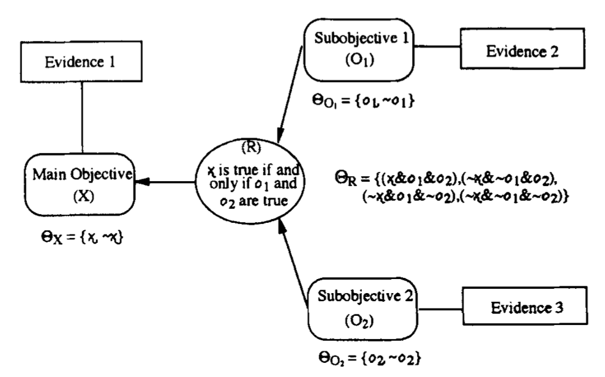

* TOC
{:toc}

General propagation method is quite complex and can be simplified when the network is an AND-tree.

Consider simple evidential network with binary variables $$X$$, $$O_1$$ and $$O_2$$ with frames (values) $$\Theta_X=\{x, \sim x\}$$, $$\Theta_{O_1}=\{o_1, \sim o_1\}$$, $$\Theta_{O_2}=\{o_2, \sim o_2\}$$.

We assume $$O_1, O_2$$ are related to $$X$$ through and AND node: $$X=x$$ iff $$O_1=o_1$$ and $$O_2=o_2$$. This relationship is incorporated by assuming that the frame of the relational node $$R$$ is: $$\Theta_R=\{(x, o_1, o_2), (\sim x, \sim o_1, \sim o_2), (\sim x, o_1, \sim o_2), (\sim x, o_1, \sim o_2)\}$$

Evidence for a variable is represented by a basic probability assignment (bpa) function: $$m_X = \big(m(x), m(\sim x), m(\{x, \sim x\})\big)$$

We assumed one item of evidence for each variable. If more than one item of evidence bear on a node, we need to first combine the items of evidence using Dempster's rule of combination.

## Recall from Dempster-Shafer theory
### Vacuous Extension
Whenever a set of m-values is propagated from a smaller node (fewer variables) to a bigger node (more variables), the m-values are said to be *vacuously extended* onto the frame of the bigger node.

Suppose we have $$m_{O_1}(o_1), m_{O_1}(\sim o_1), m_{O_1}(\{o_1, \sim o_1\})$$ defined on the frame $$\Theta_{O_1} = \{o_1, \sim o_1\}$$

We want to vacuously extend them to a bigger node consisting of $$O_1$$ and $$O_2$$. Entire frame of combined node is given by cartesian product: $$\Theta_{O_1O_2}=\{(o_1, o_2), (\sim o_1, o_2), (o_1, \sim o_2), (\sim o_1, \sim o_2)\}$$. The vacuous extension gives:
$$m(\{(o_1, o_2), (o_1, \sim o_2)\}) = m_{O_1}(o_1)$$
$$m(\{(\sim o_1, o_2), (\sim o_1, \sim o_2)\}) = m_{O_1}(\sim o_1)$$
$$m(\Theta_{O_1O_2}) = m_{O_1}(\Theta_{O_1}) \text{ (entire frame=uncertainty)}$$

m-values for other subsets of $$\Theta_{O_1O_2}$$ are zero.
### Marginalization
Propagating m-values from a node to a smaller node. Suppose we are marginalizing $$\Theta_{O_1O_2}$$ onto $$\Theta_{O_1}$$. Similar to marginalization of probabilities, we sum all m-values over elements of the bigger frame that intersect with elements of the smaller frame:
$$m(o_1) = m(o_1, o_2) + m(o_1, \sim o_2) + m(\{(o_1, o_2), (o_1, \sim o_2)\})$$
Same for $$\sim o_1$$ and $$\{o_1, \sim o_1\}$$

## Propagation in AND-tree
Note that:
* evidence bearing directly on node $$X$$ will impact indirectly $$O_1$$ and $$O_2$$
* evidence at $$O_1$$ or $$O_2$$ will not affect $$X$$ by themselves because of the AND
* evidence at $$O_1$$ alone will not affect $$O_2$$ and vice-versa

These properties are **special features of AND-trees**: **in general trees, each node is indirectly affected by the evidence at the other nodes** (see *Propagating belief functions with local computations*, Shenoy and Shafer).

Let's denote:

$$m_X^T = \oplus \{m_Y \forall \text{ variable } Y\}^{\downarrow X}$$ (combine all nodes and marginalize on $$X$$).
Goal is to compute $$m_X^T$$ for all nodes $$X$$ given $$m_Y$$ for all nodes $$Y$$.

$$m_{X\leftarrow \{O_1, \dots, O_n\}}$$ denotes bpa function for $$X$$ representing marginal of the combination of bpa functions $$m_{O_i}$$.

## Proposition 1
Propagation of m-values from sub-objectives $$O_i$$ to main objective $$X$$.

$$m_{X\leftarrow \text{all O's}} (x) = \prod_{i=1}^n m_{O_i}(o_i)$$
$$m_{X\leftarrow \text{all O's}} (\sim x) = 1-\prod_{i=1}^n \underbrace{[1-m_{O_i}(\sim o_i)]}_{\text{plausibility of }o_i}$$
$$m_{X\leftarrow \text{all O's}}(\{x, \sim x\}) = 1-m_{X\leftarrow \text{all O's}} (x)-m_{X\leftarrow \text{all O's}} (\sim x)$$

## Proof of Proposition 1

## Proposition 2
Propagation of m-values to a given sub-objective $$O_i$$ from the main objective $$X$$ and other subobjectives $$O_j, j\ne i$$.

$$m_{O_i\leftarrow \text{X & all other O's}}(o_i) = K_i^{-1} m_X(x)\prod_{j\ne i}[1-m_{o_j}(\sim o_j)]$$
$$m_{O_i\leftarrow \text{X & all other O's}} (\sim o_i) = K_i^{-1} m_X(\sim x)\prod_{j\ne i}m_{O_j}(o_j)$$
$$m_{O_i\leftarrow \text{X & all other O's}}(\{o_i, \sim o_i\}) = 1-m_{O_i\leftarrow \text{X & all other O's}}(o_i) - m_{O_i\leftarrow \text{X & all other O's}}(\sim o_i)$$

where $$K_i$$ is the normalization constant given by $$K_i=[1-m_X(x)C_i]$$ and $$C_i = 1-\prod_{j\ne i}[1-m_{o_j}(\sim o_j)]$$ (measure of conflict).

## Proof of Proposition 2
