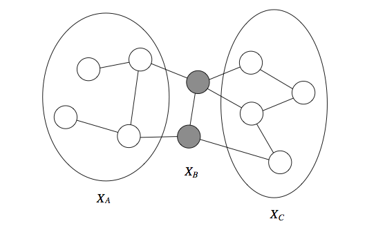
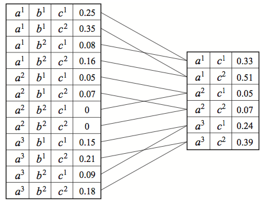

* TOC
{:toc}

[Source](https://ermongroup.github.io/cs228-notes)
## Introduction

Probabilities are inherently exponentially-sized objects; need to make assumptions about their structure.

**Naive Bayes** assumption: *conditional independence* among the variables

Three major parts in this course:
* Representation: how to specify a (tractable) model?
* Inference: given a probabilistic model, how to determine the marginal or conditional probabilities of certain events.
  * *marginal inference*: what is the probability of a given variable in the model?
  * *maximum a posteriori (MAP) inference*: most likely assignment of variables given the data.
* Learning: fitting a model to a dataset. Learning and inference are inherently linked, as inference is a key subroutine that we repeatedly call within learning algorithms.

Applications:
* Image generation (see [Radford et al.](https://arxiv.org/abs/1511.06434)). Sampling new images from a learned probability distribution $$\hat{x} \sim p(x)$$ that assigns high probability to images that resemble the ones in the training set.
* In-painting: given a patch, sample from $$p(\text{image} \vert \text{patch})$$ to complete the image.
* Image denoising: given an image corrupted by noise, model the posterior distribution $$p(\text{original image} \vert \text{noisy image})$$ and sample/use exact inference to predict the original image.
* Language models:
  * generation: sample from a probability distribution over sequences of words or characters.
  * machine translation: $$p(\text{target language sentence}\vert \text{source language sentence})$$
* Audio models:
  * upsampling or super-resolution: increase resolution of an audio signal by calculating signal values at intermediate points. Sampling/perform inference on $$p(\text{intermediate values}\vert \text{observed values})$$
  * speech synthesis
  * speech recognition

**Sidenotes**
* Judea Pearl was awarded the 2011 Turing award (Nobel prize of computer science) for founding the field of probabilistic graphical modeling.
* For a philosophical discussion of why one should use probability theory as opposed to something else: see the [Dutch book argument](https://plato.stanford.edu/entries/dutch-book/) for probabilism.

## Representation: Bayesian networks
Bayesian networks are **directed graphical models** in which each factor depends only on a small number of ancestor variables:
$$p(x_i\vert x_{i-1}, \dots, x_1) = p(x_i \vert x_{A_i})$$
where $$A_i$$ is a subset of $$\{x_1, \dots, x_{i-1}\}$$.

When the variables are discrete, we may think of the possible values of $$p(x_i \vert A_i)$$ as probability tables. If each variable takes *d* values and has at most $$k$$ ancestors, the entire table will contain at most $$\mathcal{O}(d^{k+1})$$. With one table per variable, the entire probability distribution can be compactly described with only $$\mathcal{O}(nd^{k+1})$$ parameters compared to $$\mathcal{O}(d^{n})$$ with a naive approach.

Edges indicate dependency relationships between a node $$x_i$$ and its ancestors $$A_i$$.

#### Formal definition
A Bayesian network is a directed graph $$G = (V,E)$$ together with:
* a random variable $$x_i$$ for each node $$i \in V$$
* one conditional probability distribution $$p(x_i \vert x_{A_i})$$ per node

A probability $$p$$ **factorizes** over a DAG (directed acyclic graph) $$G$$ if it can be decomposed into a product of factors, as specified by $$G$$.

We can show by counter-example that when $$G$$ contains cycles, its associated probability may not sum to one.

#### Dependencies
Let $$I(p)$$ be the set of all independencies that hold for a joint distribution $$p$$. E.g., if $$p(x,y) = p(x)p(y)$$, then $$x\perp y \in I(p)$$

Independencies can be recovered from the graph by looking at three types of structures:
* *Common parent*:
  * if $$G$$ is of the form $$A \leftarrow B \rightarrow C$$, and $$B$$ is observed, then $$A \perp C\vert B$$ ($$C$$ given $$B$$).
  * However, if $$B$$ is unobserved then $$A \not\perp C$$.
  * Intuitively, $$B$$ contains all the information that determines the outcome of $$A$$ and $$C$$; once it is observed, nothing else affects their outcome (it does not matter what value $$A$$ or $$C$$ take respective to the outcome of $$C$$ and $$A$$, respectively).
* *Cascade*:
  * if $$G$$ equals $$A \rightarrow  B \rightarrow C$$ and $$B$$ is observed, then $$A \perp C \vert B$$.
  * However, if $$B$$ is unobserved, then $$A \not\perp C$$.
* *V-structure*:
  * if $$G$$ is $$A\rightarrow C \leftarrow B$$, then knowing $$C$$ couples $$A$$ and $$B$$. I.e. $$A \perp B$$ if $$C$$ is unobserved, but $$A \not\perp B\vert C$$ ($$C$$ is observed).
  * E.g. suppose $$C$$ is true if the lawn is wet and false otherwise. $$A$$ (it rained) and $$B$$ (the sprinkler turned on) are two explanations for it being wet. If we know that $$C$$ is true (grass is wet) and $$B$$ is false (the sprinkler didn't go on), then $$p(A) = 1$$ (only other possible explanation). Hence, $$A$$ and $$B$$ are not independent given $$C$$.

  We can extend these structures by applying them recursively to any larger Bayesian net. This leads to a notion called *d*-separation (where *d* stands for directed).

  Let $$Q$$, $$W$$ and $$O$$ be three sets of nodes in a Bayesian Network $$G$$. We say that $$Q$$ and $$W$$ are ***d-separated*** given $$O$$ (i.e. the nodes in $$O$$ are observed) if $$Q$$ and $$W$$ are not connected by an *active path*. An undirected path in $$G$$ is called *active* given observed variables $$O$$ if for every consecutive triple of variables $$X, Y, Z$$ on the path, one of the following holds:
  * $$X\leftarrow Y \leftarrow Z$$ and $$Y$$ is unobserved $$Y\notin O$$
  * $$X\rightarrow Y \rightarrow Z$$ and $$Y$$ is unobserved $$Y\notin O$$
  * $$X\leftarrow Y \rightarrow Z$$ and $$Y$$ is unobserved $$Y\notin O$$
  * $$X\rightarrow Y \leftarrow Z$$ and $$Y$$ or any of its descendants are observed.

  (i.e. there is pairwise dependency between consecutive variables on the path)

In the following example, $$X_1$$ and $$X_6$$ are *d*-separated given $$X_2, X_3$$ (you cannot infer $$X_6$$ from $$X_1$$ given $$X_2, X_3$$):

However, in the next example, $$X_2, X_3$$ are not *d*-separated given $$X_1, X_6$$. There is an active path which passed through the V-structure created when $$X_6$$ is observed:

Let $$I(G)=\{(X\perp Y\vert Z): X, Y \text{are d-sep given } Z\}$$ be a set of variables that are *d*-separated in $$G$$.

***I-map:*** If $$p$$ factorizes over $$G$$, then $$I(G) \subseteq I(p)$$. We say that $$G$$ is an *I*-map (independence map) for $$p$$.

The intuition is that if $$X,Y$$ and $$Y,Z$$ are mutually dependent, so are $$X,Z$$. Thus, we can look at adjacent nodes and propagate dependencies.

In other words, all the independencies encoded in $$G$$ are sound: variables that are *d*-separated in $$G$$ are truly independent in $$p$$. However, the converse is not true: a distribution may factorize over $$G$$, yet have independencies that are not captured in $$G$$.

Note that if $$p(x,y)=p(x)p(y)$$ then this distribution still factorizes over the graph $$y \rightarrow x$$ since we can always write it as $$p(x,y)=p(x\vert y)p(y)$$ where $$p(x\vert y)$$ does not actually vary with $$y$$. However, we can construct a graph that matches the structure of $$p$$ by simply removing that unnecessary edge.

#### Representational power of directed graphs
Can directed graphs express all the independencies of any distribution $$p$$? More formally, given a distribution $$p$$, can we construct a graph $$G$$ such that $$I(G) = I(p)$$?

First, note that it is easy to construct a $$G$$ such that $$I(G) \subseteq I(p)$$; A fully connected DAG $$G$$ is an *I*-map for any distribution since $$I(G) = \emptyset$$ (there are no variables which are *d*-separated in $$G$$ since one can always find an active path; the trivial one is the one that connects the two variables and thus creates the dependency).

A more interesting question is whether we can find a *minimal* *I*-map. We may start with a fully connected $$G$$ and remove edges until $$G$$ is no longer an *I*-map (i.e. $$G$$ encodes independences that are not in $$p$$ therefore $$p$$ no longer factorizes to $$G$$). One pruning method consist in following the natural topological ordering of the graph and removing node ancestors until this is no longer possible (see structure learning at the end of course).

Does any probability distribution $$p$$ always admit a *perfect* map $$G$$ for which $$I(p) = I(G)$$. Unfortunately, the answer is no.\
For example, consider the following distribution $$p$$ over three variables $$X,Y,Z$$ (noisy-xor example)):
* we sample $$X,Y \sim \text{Ber}(0.5)$$ from a Bernoulli distribution, and we set $$Z = X \text{ xor } Y$$ ($$Z = 1$$ only when one of $$X$$ or $$Y$$ equals one).
* $$\{X\perp Y, Z\perp Y, X\perp Z\}\in I(p)$$ but $$Z\perp\{Y,X\}\notin I(p)$$ (we can deduct $$Z$$ from the other two). Thus, $$X\rightarrow Z \leftarrow Y$$ is an *I*-map for $$p$$ (every independency we can observe from $$G$$ is encoded in $$p$$), but $$Z\perp Y$$ and $$X\perp Z$$ are not in $$I(G)$$ (since the edge automatically creates an active path). The only way to capture all three independencies is to have all three nodes separated but this would not be an *I*-map (since $$Z\perp \{X,Y\}$$ would also be included). None of the 3-node graph structures that we discussed perfectly describes $$I(p)$$, and hence this distribution doesn't have a perfect map.

A related question is whether perfect maps are unique when they exist. Again, this is not the case, as $$X \rightarrow Y$$ and $$X \leftarrow Y$$ encode the same independencies, yet form different graphs. Two bayes nets $$G_1, G_2$$ are ***I-equivalent*** if they encode the same dependencies $$I(G_1) = I(G_2)$$.

When are two Bayesian nets *I*-equivalent?
Each of the graphs below have the same *skeleton* (if we drop the directionality of the arrows, we obtain the same undirected graph)

a,b and c are symmetric ($$X\perp Y\vert Z$$ but $$X\not\perp Y$$). They encode exactly the same dependencies and the directionality does not matter as long as we don't turn them into a V-structure (d). The V-structure is the only one that describes the dependency $$X \not\perp Y\vert Z$$.

**General result on *I*-equivalence:** If $$G, G'$$ have the same skeleton and the same V-structures, then $$I(G) = I(G')$$.

Intuitively, two graphs are *I*-equivalent if the *d*-separation between variables is the same. We can flip the directionality of any edge, unless it forms a v-structure, and the *d*-connectivity of the graph will be unchanged. See the textbook of *Koller and Friedman* for a full proof in Theorem 3.7 (page 77).

## Representation: Markov random fields
In Bayesian networks, unless we want to introduce false independencies among the variables, we must fall back to a less compact representation (with additional, unnecessary edges). This leads to extra parameters in the model and makes it more difficult for the model to learn them.

Markov Random Fields (MRFs) are based on *undirected* graphs. They can compactly represent independence assumptions that directed models cannot.

Unlike in the directed case, we are **not saying anything about how one variable is generated from another set of variables** (as a conditional probability distribution would). We simply indicated a **level of coupling between dependent variables** in the graph. This requires **less prior knowledge**, as we no longe have to specify a full generative story of how certain variables are constructed from others. We simply identify dependent variables and define the strength of their interactions. This defines an energy landscape over the space of possible assignments and we convert this energy to a probability via the normalization constant.

### Formal definition
A Markov Random Field is a probability distribution $$p$$ over variables $$x_1, \dots, x_n$$ defined by an *undirected* graph $$G$$.
$$p(x_1, \dots, x_n) = \frac{1}{Z} \prod_{c\in C}\phi_c(x_c)$$

* $$C$$ denotes the set of *cliques*. A clique is a fully connected subgraphs, i.e. two distinct vertices in the clique are adjacent. It can be a single node, an edge, a triangle, etc.
* Each *factor* $$\phi_c$$ is a **non-negative** function over the variables in a clique.
* The *partition function* $$Z = \sum_{x_1, \dots, x_n} \prod_{c\in C} \phi_c (x_c)$$ is a normalizing constant

*Note*: we do not need to specify a factor for each clique.

####Example

we are modeling preferences among $$A, B, C, D$$. $$(A,B), (B,C), (C,D), (D,A)$$ are friends and friends have similar voting preferences.
$$\tilde{p}(A,B,C,D) = \phi(A,B)\phi(B,C)\phi(C,D)\phi(D,A)$$
where $$\phi(X,Y) = 10\text{ if }X=Y=1, 5\text{ if }X=Y=0, 1 \text{ otherwise}$$.

The final probability is:
$$p(A,B,C,D)=\frac{1}{Z}\tilde{p}(A,B,C,D)$$
where $$Z = \sum_{A,B,C,D}\tilde{p}(A,B,D,C)$$

### Comparison to Bayesian networks
In the previous example, we had a distribution over $$A,B,C,D$$ that satisfied $$A\perp C\vert \{B, D\}$$ and $$B\perp D\vert \{A, C\}$$ (since only friends directly influence a person's vote). We can check by counter-example that these **independencies cannot be perfectly represented by a Bayesian network**. However, the MRF turns out to be a perfect map for this distribution.

Advantages:
* can be applied to a **wider range of problems in which there is no natural directionality in variable dependencies**
* can succinctly express certain dependencies that Bayesian nets cannot (converse is also true)

Drawbacks:
* computing the normalization constant $$Z$$ requires summing over a potentially exponential number of assignments. NP-hard in the general case; thus many undirected models are **intractable and require approximation techniques**.
* difficult to interpret
* much easier to generate data from a Bayesian network.

Bayesian networks are a special case of MRFs with a very specific type of clique factor (one that corresponds to a conditional probability distribution and implies a directed acyclic structure in the graph), and a normalizing constant of one.

#### Moralization
A Bayesian network can always be converted into an undirected network with normalization constant one by **adding side edges to all parents of a given node** and **removing their directionality**.

The converse is also possible, but may be intractable and may produce a very large directed graph (e.g. fully connected).

A general rule of thumb is to **use Bayesian networks whenever possible** and only switch to MRFs if there is no natural way to model the problem with a directed graph (like the voting example).

### Independencies in Markov Random Fields
**Variables $$x$$ and $$y$$ are dependent if they are connected by a path of unobserved variables**. However, if $$x$$'s neighbors are all observed, then $$x$$ is independent of all the other variables (since they influence $$x$$ only via its neighbors, referred to as the Markov blanket of $$x$$).

If a set of observed variables forms a cut-set between two halves of the graph, then variables in one half are independent from ones in the other.

We define the *Markov blanket* $$U$$ of a variable $$X$$ as the minimal set of nodes such that $$X$$ is independent from the rest of the graph if $$U$$ is observed. This holds for both directed and undirected models. For undirected models, the Markov blanket is simply equal to a node's neighborhood.

Just as in the directed case, $$I(G) \subseteq(I(p))$$, but the converse is not necessarily true. E.g.:

### Conditional Random Fields
**Special case of Markov Random Fields** when they are applied to model a **conditional probability distribution** $$p(y\vert x)$$ where $$x \in \mathcal{X}, y\in\mathcal{Y}$$ are vector-valued variables. This common setting in supervised learning is also known as *structured prediction*.

#### Formal definition
A CRF is a Markov network over variables $$\mathcal{X} \cup \mathcal{Y}$$ which specifies a conditional distribution:

$$\mathbb{P}(y\vert x) = \frac{1}{Z} \prod_{c\in C} \phi_c (x_c, y_c)$$

with partition function:

$$Z(x) = \sum_{y\in\mathcal{Y}} \prod_{c\in C} \phi_c (x_c, y_c)$$

The partition function depends on $$x$$. $$p(y\vert x)$$ encodes a different probability function for each $$x$$. Therefore, a conditional random field results in an instantiation of a new Markov Random Field for each input $$x$$.

#### Example
Recognize word from a sequence of black-and-white character images $$x_i\in[0, 1]^{d\times d}$$ (pixel matrices of size $$d$$). The output is a sequence of alphabet letters $$y_i \in \{a, b, \dots, z\}$$

We could train a classifier to separately predict each $$y_i$$ from its $$x_i$$. However, since the letters together form a word, the predictions across different positions ought to inform each other.

$$p(y\vert x)$$ is a CRF with two types of factors:
* image factors $$\phi(x_i, y_i)$$ for $$i=1, \dots, n$$ which assign higher values to $$y_i$$ that are consistent with an input $$x_i$$. Can be seen as $$p(y_i\vert x_i)$$ given by standard softmax regression e.g.
* pairwise factors $$\phi(y_i, y_{i+1})$$ for $$i=1, \dots, n-1$$. Can be seen as empirical frequencies of letter co-occurences obtained from a large corpus of text.

We can jointly infer the structured label $$y$$ using MAP inference:
$$\arg \max_y \phi(x_1, y_1)\prod_{i=2}^{n} \phi(y_{i-1}, y_i) \phi(x_i, y_i)$$

#### CRF features
In most practical applications, we assume that the factors $$\phi_c(x_c, y_c)$$ are of the form:
$$\phi_c(x_c, y_c) = \exp(w_c^\top f_c(x_c, y_c))$$

where $$f_c(x_c, y_c)$$ is an arbitrary set of features describing the compatibility between $$x_c$$ and $$y_c$$.

In the above example:
* $$f(x_i, y_i)$$ may be the probability of letter $$y_i$$ produced by logistic regression or a neural network evaluated on pixels $$x_i$$.
* $$f(y_i, y_{i+1}) = \mathbb{I}(y_i = l_1, y_{i+1} = l_2)$$ where $$l_1, l_2$$ are two letters of the alphabet. The CRF would then learn weights $$w$$ that would assign more weight to more common probability of consecutive letters $$(l_1, l_2)$$ (useful when $$y_i$$ given $$x_i$$ is ambiguous).

CRF features can be arbitrarily complex. We can define a model with factors $$\phi(x, y_i) = \exp (w_i^\top f(x, y_i))$$ that depend on the entire input $$x$$. Does not affect computational performance since $$x$$ is observed (does not change the scope of the factors, just their values).

**MRF models the joint distribution $$p(x,y)$$** and needs to fit two distributions $$p(y\vert x)$$ and $$p(x)$$. However, if we want to predict $$y$$ given $$x$$, modeling $$p(x)$$ is unnecessary and disadvantageous to do so:
* statistically: not enough data to fit both $$p(y\vert x)$$ and $$p(x)$$ because, since the models have shared parameters (the same graph), fitting one may not result in the best parameters for the other
* computationally: we also need to make simplifying assumption in the distribution so that $$p(x)$$ can be tractable.

CRFs forgo this assumption and often **perform better on prediction tasks.**

### Factor Graphs
Bipartite graph where one group is the variables (round nodes) in the distribution being modeled and the other group is the factors defined on these variables (square nodes). Useful to see factor dependencies between variables explicitly, and facilitates computation.

## Representation: Variable elimination (VE)
* **Marginal inference**: probability of a given variable $$p(y=1) = \sum_{x_1} \dots \sum_{x_n} p(y=1, x_1, \dots, x_n)$$
* **Maximum a posteriori (MAP) inference**: most likely assignment to the variables in the model possibly conditioned on evidence $$\max_{x_1 \dots x_n} p(y=1, x_1, \dots, x_n)$$

NP-hard: whether inference is tractable depends on the structure of the graph. If problem is intractable, we use approximate inference methods.

*Variable elimination* is an **exact** inference algorithm. Let $$x_i$$ be discrete variables taking $$k$$ possible values each (also extends to continuous distributions).

### Example
Chain Bayesian network: $$p(x_1, \dots, x_n) = p(x_1)\prod_{i=2}^n p(x_i \vert x_{i-1})$$

How to compute marginal probability $$p(x_n)$$ ?

Naive way is summing probability over all $$k^{n-1}$$ assignments:

$$p(x_n)=\sum_{x_1} \dots \sum_{x_{n-1}}p(x_1, \dots, x_n)$$
we can do much better by leveraging factorization in probability distribution:
$$p(x_n) = \sum_{x_1} \dots \sum_{x_{n-1}} p(x_1) \prod_{i=2}^n p(x_i \vert x_{i-1})$$
$$=\sum_{x_1}p(x_1)\bigg[\sum_{x_2}p(x_2\vert x_1)\big[\dots\sum_{x_{n-1}}p(x_n\vert x_{n-1})\big]\bigg]$$
$$=\sum_{x_2}\underbrace{\sum_{x_1}p(x_2\vert x_1)p(x_1)}_{p(x_2)}\times \sum_{x_3}\sum_{x_2}p(x_3\vert x_2)p(x_2)\times\dots\times\underbrace{\sum_{x_{n-1}}p(x_n\vert x_{n-1})p(x_{n-1})}_{p(x_n)}$$
$$=\underbrace{\tau(x_2)}_{p(x_{21})+\dots+p(x_{2k})}\times\tau(x_3)\times \dots$$

Each $$\tau$$ has complexity $$\mathcal{0}(k^2)$$ and we calculate $$n$$ of them, thus overall complexity is $$\mathcal{0}(nk^2)$$ (much better than $$\mathcal{O}(k^n)$$).

### Formal Definition
Graphical model as product of factors: $$p(x_1, \dots, x_n) = \prod_{c\in C} \phi_c(x_c)$$
Variable elimination algorithm (instance of dynamic programming) performs two factor operations:
* product $$\phi_3(x_c) = \phi_1(x_c^{(1)})\times \phi_2(x_c^{(2)})$$. $$x_c^{(i)}$$ denotes an assignment to the variables in the scope of $$\phi_i$$ e.g.: $$\phi_3(a,b,c) = \phi(a,b)\times\phi_2(b,c)$$
* marginalization: $$\tau(x) = \sum_y \phi(x,y)$$. $$\tau$$ is the *marginalized factor* and does not necessarily correspond to a probability distribution even if $$\phi$$ was a CPD.

Marginalizing $$B$$ from $$\phi(A,B,C)$$. For $$(a_1, c_1)$$: $$0.25+0.08=0.33$$.

Variable elimination requires an ordering over the variables according to which variables will be eliminated (e.g. ordering implied by the DAG, see example).
* the ordering affects the running time (as the variables become more coupled)
* finding the best ordering is NP-hard

Let the ordering $$O$$ be fixed. According to $$O$$, for each variable $$X_i$$:
1. Multiply all factors $$\Phi_i$$ containing $$X_i$$
2. Marginalize out $$X_i$$ to obtain new factor $$\tau$$
3. replace factors $$\Phi_i$$ with $$\tau$$

Running time of Variable Elimination is $$\mathcal{O}(nk^{M+1})$$ where $$M$$ is the maximum size (number of variables) of any factor $$\tau$$ formed during the elimination process and $$n$$ is the number of variables.

Choosing optimal VE ordering is NP-hard. In practice, we resort to heuristics:
* *min-neighbors*: choose variable with fewest dependent variables
* *min-weight*: choose variables to minimize the product of cardinalities of its dependent variables
* *min-fill*: choose vertices to minimize the size of the factor that will be added to the graph

## Junction Tree (JT) algorithm
When computing marginals, VE produces many intermediate factors $$\tau$$ as a side-product. These factors are the same as the ones that we need to answer other marginal queries. By caching them, we can answer new marginal queries at no additional cost.

VE and JT algorithm are two flavors of dynamic programming: top-down DP vs bottom-up table filling.

JT first executes **two runs of VE** to initialize a particular data structure: bottom-up to get root probabilities $$\tau(x)=\sum_y \phi(x,y)$$; and top-down to get leaf probabilities $$\tau(y)=\sum_x \phi(x,y)$$. It can then answer marginal queries in $$\mathcal{O}(1)$$ time.

Two variants: belief propagation (BP) (applies to tree-structured graphs) and full junction tree method (general networks).

### Belief propagation
#### Variable elimination as message passing
Consider running VE algorithm on a tree to compute marginal $$p(x_i)$$. Optimal ordering: rooting the tree at $$x_i$$ and iterating in post-order (leaves to root s.t. nodes are visited after their children). This ordering is optimal because the largest clique formed during VE has size 2.

At each step, eliminate $$x_j$$ by computing $$\tau_k(x_k) = \sum_{x_j} \phi(x_k, x_j)\tau_j(x_j)$$ (where $$x_k$$ is parent of $$x_j$$). $$\tau_j(x_j)$$ can be thought of as a message sent from $$x_j$$ to $$x_k$$ that summarizes all the information from the subtree rooted at $$x_j$$.

Say, after computing $$p(x_i)$$ we want to compute $$p(x_k)$$; we would run VE again with $$x_k$$ as root. However, we already computed the messages received by $$x_k$$ when $$x_i$$ was root (since there is only one path connecting two nodes in a tree).

#### Message passing algorithm
(assumes tree structure)
* a node $$x_i$$ sends a message to a neighbor $$x_j$$ whenever it has received messages from all nodes besides $$x_j$$.
* There will always be a node with a message to send, unless all the messages have been sent out.
* Since each edge can receive one message in both directions, all messages will have been sent out after $$2\lvert E \rvert$$ steps (to get all marginals, we need all incoming messages for every node: bottom-up and then top-down).
* Messages are defined as intermediate factors in the VE algorithm

Two variants: *sum-product message passing* (for marginal inference) and *max-product message passing* (for MAP inference)

##### Sum-product message passing
$$m_{i\rightarrow j}(x_j) = \sum_{x_i} \phi(x_i, x_j) \prod_{l\in N(i)\setminus j} m_{l\rightarrow i}(x_i)$$

(i.e. sum over all possible values taken by $$x_i$$)

After computing all messages, we may answer any marginal query over $$x_i$$ in constant time:
$$p(x_i) \propto \phi(x_i) \prod_{l\in N(i)\setminus j} m_{l\rightarrow i}(x_i)$$

##### Sum-product message passing for factor trees
Recall that a factor graph is a bipartite graph with edges going between variables and factors.

Two types of messages:
* variable-to-factor messages $$\nu$$
* factor-to-variable messages $$\mu$$

$$\nu_{var(i)\rightarrow fac(s)} (x_i) = \prod_{t\in N(i)\setminus s} \mu_{fac(t)\rightarrow var(i)} (x_i)$$

$$\mu_{fac(s)\rightarrow var(i)}(x_i) = \sum_{x_{N(s)\setminus i}} f_s(x_{N(s)})\prod_{j\in N(s)\setminus i} \nu_{var(j)\rightarrow fac(s)}(x_j)$$

As long as there is a factor (or variable) ready to transmit to a variable (or factor), send message as defined above. Therefore, an edge receives exactly two messages (from variable to factor and factor to variable)

##### Max-product message passing
Since MRF factors are non-negative, max operator distributes over products, just like the sum (in general, max only distributes over products of non-negative factors, since within the max, two large negative factors can become a large positive factor, although taken separately, their maximum could be small positive factors).

E.g., for a chain MRF:
$$\tilde{p}^* = \max_{x_1}\dots \max_{x_n}\phi(x_1)\prod_{i=2}^n \phi(x_i, x_{i-1})$$
$$= \max_{x_n} \max_{x_{n-1}} \phi(x_n, x_{n-1}) \max_{x_{n-2}} \phi(x_{n-1}, x_{n-2})\dots \max_{x_1} \phi(x_2, x_1)\phi(x_1)$$

Since both problems decompose the same way we can **reuse the same approach as for marginal inference** (also applies to factor trees).

If we also want the $$\arg \max$$, we can keep **back-pointers** during the optimization procedure.

### Junction tree algorithm
* If **graph not a tree, inference will not be tractable**.
* However, we can **partition the graph into a tree of clusters** that are amenable to the variable elimination algorithm.
* Then we simply perform message-passing on this tree.
* Within a cluster, variables could be highly coupled but interactions among clusters will have a tree structure.
* yields tractable global solutions if the local problems can be solved exactly.

Suppose we have undirected graphical model $$G$$ (if directed, take the *moralized* graph). A junction tree $$T=(C, E_T)$$ over $$G=(\chi, E_G)$$ is a tree whose nodes $$c\in C$$ are associated with subsets $$x_c \subseteq \chi$$ of the graph vertices (i.e. sets of variables). Must satisfy:
* *family preservation*: for each factor $$\phi$$ there is a cluster $$c$$ such that $$\underbrace{\text{scope}}_{\text{variables taken as input}}[\phi] \subseteq x_c$$
* *running intersection*: for every pair of clusters $$c^{(i)}, c^{(j)}$$, every cluster on the path between $$c^{(i)},c^{(j)}$$ contains $$x_c^{(i)} \cap x_c^{(j)}$$

Example of MRF with graph $$G$$ and junction tree $$T$$:

* MRF potentials (i.e. product of the factors) are denoted using different colors
* circles are nodes of the junction tree
* rectangles are *sepsets* (separation sets) (= sets of variables shared by neighboring clusters)

Trivial junction tree: one node containing all the variables in $$G$$ (useless because brute force marginalization algorithm)

Optimal trees make the clusters as small and modular as possible: NP hard to find one.

Special case: when $$G$$ itself is a tree, define a cluster for each edge.

Example of invalid junction tree that does not satisfy running intersection property (green cluster should contain intersection of red and purple):

#### Algorithm
Let us define potential $$\psi_c (x_c)$$ of each cluster $$c$$ as the product of all the factors $$\phi$$ in $$G$$ that have been assigned to $$c$$.

By family preservation property, this is well defined and we may assume distribution in the form:
$$p(x_1, \dots, x_n)=\frac{1}{Z} \prod_{c\in C} \psi_c (x_c)$$

At each step of the algorithm, we choose a pair of adjacent clusters $$c^{(i)}, c^{(j)}$$ in $$T$$ and compute message whose scope is the sepset $$S_{ij}$$ between the two clusters:

$$m_{i\rightarrow j} (S_{ij})=\sum_{x_c \setminus S_{ij}} \psi_c (x_c) \prod_{l\in N(i)\setminus j} m_{l\rightarrow i} (S_{li})$$

$$x_c$$ are variables in the cluster $$c^{(i)}$$.

We choose $$c^{(i)}, c^{(j)}$$ only if $$c^{(i)}$$ has received messages from all of its neighbors except $$c^{(j)}$$. Terminates in $$2\lvert E_T \rvert$$ steps just as in belief propagation (bottom-up then top-down to get all messages).

We then define belief of each cluster based on all the messages that it receives:
$$\beta_c(x_c) = \psi_c(x_c) \prod_{l\in N(i)} m_{l\rightarrow i} (S_{li})$$
(often referred to as *Shafer-Shenoy* updates)

Beliefs will be proportional to the marginal probabilities over their scopes: $$\beta_c(x_c) \propto p(x_c)$$.

We answer queries of the form $$\tilde{p}(x), x\in x_c$$ by marginalizing out the variable in its belief:
$$\tilde{p}(x) = \sum_{x_c \setminus x} \beta_c (x_c)$$

(requires brute force sum over all variables in $$x_c$$)

Normalize by partition function $$Z=\sum_{x_c}\beta_c (x_c)$$ (sum of all the beliefs in a cluster).

Running time is **exponential in the size of the largest cluster** (because we need to marginalize out variables from the cluster; must be done using brute force).

#### Variable elimination over a junction tree
Running VE with a certain ordering is equivalent to performing message passing on the junction tree.

We may prove correctness of the JT algorithm through an induction argument on the  number of factors $$\psi$$. The key property that makes this argument possible is the running intersection property (assures that it's safe to eliminate a variable from a leaf cluster that is not found in that cluster's sepset since it cannot occur anywhere except that one cluster)

The caching approach used for belief propagation extends to junction trees.

#### Finding a good junction tree
* by hand: model has regular structure for which there is an obvious solution (e.g. when model is a grid, clusters are pairs of adjacent rows)
* using variable elimination: running the VE elimination algorithm implicitly generates a junction tree over the variables. Thus, it is possible to use the heuristics discussed earlier

### Loopy belief propagation
Technique for performing inference on complex (non-tree) graphs.

Running time of JT is exponential in size of the largest cluster. In some cases, we can give quick **approximate solution**.

Suppose we are given a MRF with pairwise potentials. Main idea is to **disregard loops** and perform message passing anyway.
$$m_{i\rightarrow j}^{t+1}(x_j) = \sum_{x_i} \phi(x_i)\phi(x_i, x_j) \prod_{l\in N(i)\setminus j} m_{l\rightarrow i}^t (x_i)$$

Keep performing these updates for fixed number of steps or until convergence of messages. All messages are typically initialized with uniform distribution.

* Performs surprisingly well in practice
* Provably converges on trees and on graphs with at most one cycle
* However it may not converge and beliefs may not necessarily be equal to true marginals
* special case of *variational inference* algorithm

## MAP Inference
$$\max_x \log p(x) = \max_x \sum_c \log \phi_c (x_c) - \log Z$$

* Intractable partition constant $$Z$$ doesn't depend on $$x$$ and can be ignored.
* Marginal inference is summing all assignments, one of which is MAP assignment
* we could replace summation with maximization, however there exists more efficient methods

Many intractable problems as special case.\
E.g.: 3-sat. For each clause $$c=(x\lor y \lor \lnot z)$$ a factor $$\theta_c (x,y,z)=1$$ if $$c$$ and $$0$$ otherwise. 3-sat instance satisfiable iff the value of the MAP assignment equals the number of clauses.

We may use similar construction to prove that marginal inference is NP-hard: add additional variable $$X=1$$ when all clauses are satisfied and $$0$$ otherwise. Its marginal probability will be $$\geq 0$$ iff the 3-sat instance is satisfiable

*Example*: image segmentation (input $$x\in[0,1]^{d\times d}$$; predict label $$y\in\{0,1\}^{d\times d}$$ indicating wether each pixel encodes the object we want to recover). Intuitively, neighboring pixels should have similar values. This prior knowledge can be modeled via an Ising model (see box 4.C p. 128 in Koller and Friedman)

### Graph cuts
See Koller and Friedman 13.6

Efficient MAP inference algorithm for certain Potts models over binary-valued variables. Returns optimal solution in polynomial time regardless of structural complexity of the underlying graph.

A *graph cut* of undirected graph is a partition of nodes into 2 disjoint sets $$V_s$$, $$V_t$$. Let each edge be associated with a non-negative cost. Cost of a graph cut is the sum of the costs of the edges that cross between the two partitions:
$$\text{cost}(V_s, V_t) =\sum_{v_1\in V, v_2 \in V_t}\text{cost} (v_1, v_2)$$

*min-cut* problem is finding the partition that minimizes the cost of the graph cut. See algorithms textbooks for details.

#### Reduction of MAP inference on a particular class of MRFs to the min-cut problem
See Metric MRFs model box 4.D p. 127 in Koller and Friedman

MRF over binary variables with pairwise factors in which edge energies (i.e., negative log-edge factors) take the form:
$$E_{uv}(x_u, x_v) = 0\text{ if }x_u = x_v\text{ and }\underbrace{\lambda_{uv}}_{\text{cost of edge mismatch}}\text{ if }x_u \ne x_v$$

Each node has unary potential described by energy function $$E_u(x_u)$$ (normalized by substracting the $$\min E_u$$so that its $$\geq 0$$ with either $$E_u(1)=0$$ or $$E_u(0)=0$$).

$$p(x) = \frac{1}{Z}\exp -\bigg[ \sum_u E_u(x_u) + \sum_{u,v\in \mathcal{E}}E_{uv}(x_u, x_v)\bigg]$$

Motivation comes from image segmentation: reduce discordance between adjacent variables.

Formulate as a min-cut problem in augmented graph: add special source and sink nodes $$s, t$$
* $$s$$ represents the object (assignment of $$0$$) and $$t$$ the background (assignment of $$1$$)
* remember that either $$E_u(1)=0$$ or $$E_u(0)=1$$ since we normalized
* node $$s$$ is connected to nodes $$u$$ with $$E_u(0) = 0$$ by an edge with weight $$E_u(1)$$
* node $$t$$ is connected to nodes $$v$$ with $$E_v(1)=0$$ by edge with weight $$E_v(0)$$
* thus every node is either connected to the source or the sink
* an edge only makes a contribution to the cost of the cut if the nodes are on opposite sides and its contribution is the $$\lambda_{uv}$$ of the edge.

The cost of the cut (unary potentials and edge contributions) is precisely the energy of the assignment.

Segmentation task in a 2x2 MRF as a graph cut problem:

Refer to Koller and Friedman textbook for more general models with *submodular* edge potentials.

### Linear programming approach
Graph-cut only applicable in restricted classes of MRFs.

#### Linear Programming (LP)
Linear programming (a.k.a. linear optimization) refers to problems of the form:
$$\min_x c\cdot x \text{ subject to }Ax\leq b$$
with $$x\in\mathbb{R}^{n}$$, $$c,b\in\mathbb{R}^n$$ and $$A\in\mathbb{R}^{n\times n}$$.

* Has been extensively studied since the 1930s
* Major breakthrough of applied mathematics in the 1980s was the development of [polynomial-time algorithms](https://en.wikipedia.org/wiki/Karmarkar%27s_algorithm) for linear programming
* Practical tools like CPLEX that can solve very large LP instances (100,000 variables or more) in reasonable time.

####Integer Linear Programming (ILP)
* extension of linear programming which also requires $$x\in\{0,1\}^n$$
* NP-hard in general
* Nonetheless, many heuristics exist such as *rounding*:
  * relaxed constraint $$0\leq x\leq 1$$ then round solution
  * works surprisingly well in practice and has theoretical guarantees for some classes of ILPs

#### Formulating MAP inference as ILP
Introduce two types of indicator variables:
* $$\mu_i(x_i)$$ for each $$i\in V$$ and state $$x_i$$
* $$\mu_{ij}(x_i, x_j)$$ for each edge $$(i,j)\in \mathcal{E}$$ and pair of states $$x_i, x_j$$

MAP objective becomes:

$$\max_{\mu} \sum_{i\in V}\sum_{x_i} \theta_i(x_i)\mu_i(x_i) + \sum_{i,j\in E}\sum_{x_i, x_j}\theta_{ij}(x_i, x_j)\mu_{ij}(x_i, x_j)$$

(function $theta$ represents $log \phi$)

With constraints:

$$\mu_i(x_i)\in \{0, 1\}\forall i, x_i$$

$$\sum_{x_i}\mu_i(x_i)=1\forall i$$

$$\mu_{ij}(x_i, x_j)\in \{0, 1\}\forall i,j \in E, x_i, x_j$$

$$\sum_{x_i, x_j}\mu_{ij}(x_i, x_j) = 1 \forall i,j \in E$$

Assignments must also be consistent:

$$\sum_{x_i} \mu_{ij}(x_i, x_j) = \mu_j(x_j) \forall i,j \in E, x_j$$

$$\sum_{x_j} \mu_{ij}(x_i, x_j) = \mu_i(x_i) \forall i,j \in E, x_i$$

(we have to optimize over the edges too because an edge between two variables at given states contributes to the cost)

* solution to this linear program equals MAP assignment
* NP-hard but can transform this into an LP via relaxation
* in general, this method gives only approximate solutions
* for tree-structured graphs, relaxation is guaranteed to return integer solutions, which are optimal (see *Koller and Friedman* textbook for proof)

### Dual decomposition
* See [Sontag et al.](https://people.csail.mit.edu/dsontag/papers/SonGloJaa_optbook.pdf)
* See notes on Berkeley EE227C

Suppose MRF of the form:
$$\max_{x} \sum_{i\in V}\theta_i(x_i) + \sum_{f\in F}\theta_f(x_f)$$
Where $$F$$ denote arbitrary factors (e.g. edge potentials in pairwise MRF)

Consider decoupled objective:
$$\sum_{i\in V}\max_{x_i} \theta_i(x_i) + \sum_{f\in F}\max_{x^f} \theta_f (x^f)$$

Should encourage consistency between potentials:
$$x_i^f - x_i = 0 \forall f,\forall i\in f$$ (i.e. variable assignments chosen for an edge should be the same as for the corresponding nodes)

*Lagrangian* of the constrained problem ($x^f$ and $x$ are assignments of the variable):
$$L(\delta, x^f, x)=\sum_{i\in V}\theta_i (x_i) + \sum_{f\in F}\theta_f(x^f) + \sum_{f\in F}\sum_{i\in f}\sum_{x_i'} \underbrace{\delta_{f_i}(x_i')}_{\text{Lagrange multiplier}}\bigg( \mathbb{I}_{x_i' = x_i} - \mathbb{I}_{x_i' = x_i^f}\bigg)$$

$$\forall \theta: L(\delta) := \max_{x^f, x} L(\delta, x^f, x)\geq p^*$$ (lower bound with respect to $$\delta$$ is optimal value of the objective)

We can reparameterize the Lagrangian as:

$$L(\delta) = \sum_{i \in V} \max_{x_i} \left( \theta_i (x_i) + \sum_{f:i \in f} \delta_{fi}(x_i) \right) + \sum_{f \in F} \max_{x^f} \left( \theta_f (x^f) - \sum_{i \in f} \delta_{fi}(x_i) \right)$$
$$= \sum_{i \in V} \max_{x_i} \bar \theta_{i}^\delta (x_i) + \sum_{f \in F} \max_{x^f} \bar \theta_{f}^\delta (x^f)$$

Suppose we can find dual variables $$\bar \delta$$ such that the local maximizers of $$\bar \theta_{i}^{\bar \delta} (x_i)$$ and $$\bar \theta_{f}^{\bar \delta} (x^f)$$ agree; in other words, we can find a $$\bar x$$ such that $$\bar x_i \in \arg\max_{x_i} \bar \theta_{i}^{\bar \delta} (x_i)$$ and $$\bar x^f \in \arg\max_{x^f} \bar \theta_{f}^{\bar \delta} (x^f)$$. Then we have that:

$$ L(\bar \delta) = \sum_{i \in V} \bar \theta_{i}^{\bar\delta} (\bar x_i) + \sum_{f \in F} \bar \theta_{f}^{\bar\delta} (\bar x^f) = \sum_{i \in V} \theta_i (\bar x_i) + \sum_{f \in F} \theta_f (\bar x^f). $$

Second equalities follows because terms involving Lagrange multipliers cancel out when $$x$$ and $$x^f$$ agree.

On the other hand, by definition of $$p^*$$:

$$ \sum_{i \in V} \theta_i (\bar x_i) + \sum_{f \in F} \theta_f (\bar x^f) \leq p^* \leq L(\bar\delta) $$

which implies that $$L(\bar\delta) = p^*$$.

Thus:
* bound given by Lagrangian can be made tight for the right choice of $$\delta$$
* we can compute $$p^*$$ by finding a $$\delta$$ at which the local sub-problems agree with each other

#### Minimizing the objective
$$L(\delta)$$ is continuous and convex (point-wise max of a set of affine functions, see EE227C), we may minimizing using subgradient descent or block coordinate descent (faster). Objective is not *strongly* convex, thus minimum is not global.

#### Recovering MAP assignment
As shown above, if a solution $$x,x^f$$ agrees for some $$\delta$$, it is optimal.

If each $$\bar \theta_i^{\delta^*}$$ has a unique maximum, problem is decodable. If some variables do not have a unique maximum, then we assign their optimal values to the ones that can be uniquely decoded to their optimal values and use exact inference to find the remaining variables' values. (NP-hard but usually not a big problem)

How can we decouple variables from each other? Isn't that impossible due to the edges costs?

### Local search
Start with arbitrary assignment and perform "moves" on the joint assignment that locally increases the probability. No guarantees but prior knowledge makes effective moves.

### Branch and bound
Exhaustive search over the space of assignments, while pruning branches that can be provably shown not to contain a MAP assignment (like backtracking ?). LP relaxation or its dual can be used to obtain upper bounds and prune trees.

### Simulated annealing
Read more about this

Sampling methods (e.g. Metropolis-Hastings) to sample form:
$$p_t(x)\propto \exp (\frac{1}{t}\sum_{c\in C}\theta_c(x_c))$$

$$t$$ is called the temperature:
* As $$t\to \infty$$, $$p_t$$ is close to the uniform distribution, which is easy to sample from
* As $$t\to 0$$, $$p_t$$ places more weight on $$\arg \max_x \sum_{c\in C}\theta_c(x_c)$$ (quantity we want to recover). However, since the distribution is highly peaked, it is difficult to sample from.

Idea of simulated annealing is to run sampling algorithm starting with high $$t$$ and gradually decrease it. If "cooling rate" is sufficiently slow (requires lots of tuning), we are guaranteed to find the mode of the distribution.

## Sampling methods
Interesting classes of models may not admit exact polynomial-time solutions at all.
Two families of approximate algorithms:
* *variational* methods (take their name from *calculus of variations* = optimizing functions that take other functions as arguments): formulate inference as an optimization problem
* *sampling* methods: main way of performing approximate inference over the past 15 years before variational methods emerged as viable and superior alternatives

### Forward (aka ancestral) sampling
Bayesian network with multinomial variables. Samples variables in topological order:

* start by sampling variables with no parents
* then sample from the next generation by conditioning on the values sampled before
* proceed until all $$n$$ variables have been sampled
linear $$\mathcal{O}(n)$$ time by taking exactly **1 multinomial sample** from each CPD

Assume multinomial distribution with $$k$$ outcomes and associated probabilties $$\theta_1, \dots, \theta_k$$. Subdivide unit interval into $$k$$ regions with size $$\theta_i, 1\leq i \leq k$$ and sample uniformly from $$[0, 1]$$:

Forward sampling can also be performed on undirected models if the model can be represented by a clique tree with a small number of variables per node:
* calibrate clique tree; gives us marginal distribution over each node and choose node to be root
* marginalize over variables in the root node to get the marginal for a single variable
* sample from each variables in the node, each time incorporating newly sampled values as evidence $$x_3 \sim p(X_3=x_3 \vert X_1=x_1, X_2=x_2)$$
* move down the tree to sample from other nodes and send updated message containing values of the sampled variables.

### Monte Carlo estimation
Name refers to famous casino in Monaco. Term was coined as codeword by physicists working on the atomic bomb as part of the Manhattan project.

Constructs solutions based on large number of samples. E.g. consider the following integral:

$$\mathbb{E}_{x\sim p}[f(x)]\approx I_T = \frac{1}{T}\sum_{t=1}^T f(x^t)$$

Since samples are i.i.d., MC estimate is unbiased and variance is inversely proportional to $$T$$.

### Rejection sampling
Special case of Monte Carlo integration. Compute area of a region $$R$$ by sampling in a larger region with known area and recording the fraction of samples that falls within $$R$$.

E.g., Bayesian network over set of variables $$X=Z\cup E$$. We use rejection sampling to compute marginal probabilities $$p(E=e)$$:

$$p(E=e)=\sum_z p(Z=z, E=e)=\sum_x p(x)\mathbb{I}(E=e)=\mathbb{E}_{x\sim p}\big[\mathbb{I}(E=e)\big]$$

and then take the Monte Carlo approximation.

### Importance sampling
See [Art Owen's lecture notes about importance sampling](https://statweb.stanford.edu/~owen/mc/Ch-var-is.pdf)

Suppose we want to compute $$\mu = \mathbb{E}[f(X)]$$ where $$f(x)$$ is nearly zero outside a region $$A$$ for which $$P(X\in A)$$ is small. A plain Monte Carlo sample would be very wasteful and could fail to have even one point inside the region $$A$$.

Let $$q$$ be a known probability density function (importance sampling distribution):
$$\mu = \int f(x)p(x)dx = \int \frac{f(x)p(x)}{q(x)}q(x)dx=\mathbb{E}_q\bigg(\frac{f(X)p(X)}{q(X)}\bigg)$$

The *importance sampling estimate* of $$\mu$$ is:
$$\hat{\mu}_q = \frac{1}{n} \sum_{i=1}^n \frac{f(X_i)p(X_i)}{q(X_i)}$$
Assuming we can compute $$fp/q$$

We have $$\mathbb{E}_q(\hat{\mu}_q) = \mu$$ (unbiased estimate) and: $$\text{Var}_q(\hat{\mu}_q)=\text{Var}(\frac{1}{n} \sum fp/q) = \frac{\sigma_q^2}{n}$$
where $$\sigma_q^2 = \int \big(\frac{f(x)p(x)}{q(x)}\big)^2 dx - \mu^2 = \int \big(\frac{f(x)p(x) - \mu q(x)}{q(x)}\big)^2 dx$$

Therefore, the numerator is small when $$q$$ is nearly proportional to $$fp$$. Small values of $$q$$ greatly magnify whatever lack of proportionality appears in the numerator. It is good for q to have spikes in the same places that $$fp$$ does.

Having $$q$$ follow a uniform distribution collapses to plain Monte Carlo.

### Normalized importance sampling
When estimating fraction of two probabilities (e.g. a conditional proba), if we sample each proba separately, errors compound and variance can be high. If we use the same samples to evaluate the fraction, estimator is biased but asymptotically unbiased and we avoid the issue of compounding errors.

See [notes on website](https://ermongroup.github.io/cs228-notes/inference/sampling/)

### Markov Chain Monte Carlo
Developped during the Manhattan project. One of the [10 most important algorithms](https://archive.siam.org/pdf/news/637.pdf) of the 20th century.

Used to perform marginal and MAP inference as opposed to computing expectations.

We construct a Markov chain whose states are joint assignments of the variables and whose stationary distribution equals the model probability $$p$$.

1. Run Markov chain from initial state for $$B$$ *burn-in* steps (number of steps needed to converge to stationary distribution, see *mixing time*)
2. Run Markov chain for $$N$$ *sampling* steps

We produce Monte Carlo estimates of marginal probabilities. We then take the sample with highest probability to perform MAP inference.

Two algorithms:
* Metropolis-Hastings
* Gibbs sampling (special case of Metropolis-Hastings)

For distributions that have narrow modes, the algorithm will sample from a given mode for a long time with high probability. Therefore, convergence will be slow.

See [IEOR263A lecture notes](#)

See [Markov Chain Monte Carlo without detailed balance](https://arxiv.org/pdf/1007.2262.pdf)

## Variational Inference
Inference as an **optimization problem**: given intractable distribution $$p$$ and class of tractable distributions $$\mathcal{Q}$$, find $$q\in \mathcal{Q}$$ that is most similar to $$p$$.

Unlike sampling-based methods:
* variational approaches will not find globally optimal solution
* but we always know if they have converged and even have bounds on their accuracy
* scale better and more amenable to techniques like stochastic gradient optimization, parallelization over multiple processors, acceleration using GPUs

### Kullback-Leibler divergence
Need to choose approximation family $$\mathcal{Q}$$ and optimization objective $$J(q)$$ that captures similarity between $$q$$ and $$p$$. Information theory provides us with *Kullback-Leibler (KL) divergence*.

For two distributions with discrete support:
$$KL(q \Vert p)=\sum_{x\sim q}  q(x) \log \frac{q(x)}{\log p(x)} $$
with properties:
$$KL(q\Vert p) \geq 0 \forall q,p$$
$$KL(q\Vert p) = 0$$ iff $$q=p$$

It is however asymmetric: $$KL(q\Vert p) \ne KL(p \Vert q)$$. That is why it is called a divergence and not a distance.

### Variational lower bound
Use unnormalized distribution $$\tilde{p}$$ instead of $$p$$ because evaluating $$KL(q\rVert p )$$ is intractable because of normalization constant.

Important property:
$$J(q) = \sum_x q(x)\log \frac{q(x)}{\tilde{p}(x)} = \sum_x q(x) \log \frac{q(x)}{p(x)} - \log Z(\theta) = KL(q\Vert p) - \log Z(\theta)$$
Therefore $$\log Z(\theta) = \underbrace{KL(q\Vert p)}_{\geq 0} - J(q)\geq -J(q)$$

$$-J(q)$$ is called the variational lower bound or evidence lower bound (ELBO) and often written in the form:
$$\log Z(\theta) \geq \mathbb{E}_{q(x)}[\log \tilde{p}(x) - \log q(x)]$$

E.g.: If we are trying to compute marginal probability $$p(x\vert D) = p(x,D)/p(D)$$, minimizing $$J(q)$$ amounts to maximizing a lower bound on log-likelihood $$\log p(D)$$ of the observed data.

By maximizing evidence-lower bound, we are minimizing $$KL(q\rVert p)$$ by squeezing it between $$-J(q)$$ and $$\log Z(\theta)$$.

### $$KL(q\Vert p)$$ or $$KL(p\Vert q)$$?
Computationally, computing $$KL(p\Vert q)$$ involves an expectation with respect to $$p$$ which is typically intractable to evaluate

$$KL(q\Vert p)$$ is called the I-projection (information projection) and is infinite when $$p(x)=0$$ and $$q(x) > 0$$. Therefore, if $$p(x)=0$$ we must have $$q(x)=0$$. We say that $$KL(q\Vert p)$$ is *zero-forcing* for $$q$$ and it **under-estimates the support of $$p$$**. It is called the *inclusive* KL divergence.

$$KL(p\Vert q)$$ is called the M-projection (moment projection) and is infinite if $$q(x)=0$$ and $$p(x)>0$$ thus if $$p(x)>0$$ we must have $$q(x)>0$$. $$KL(p\Vert q)$$ is *zero-avoiding* for $$q$$ and it **over-estimates the support of $$p$$**. It is called the *exclusive* KL divergence.

E.g.: fitting unimodal approximating distribution (red) to multimodal (blue). $$KL(q\Vert p)$$ leads to *a)* and $$KL(p \Vert q)$$ leads to *b)* and *c)*.

### Mean-field inference
How to choose approximating family $$\mathcal{Q}$$?

One of most widely used classes is set of fully-factored $$q(x)=q_1(x_1)q_2(x_2)\dots q_n(x_n)$$. Each $$q_i$$ is a categorical distribution over a one-dimensional discrete variable. This is called *mean-field* inference and consists in solving:

$$\min_{q_1, \dots, q_n} J(q)$$

via coordinate descent over the $$q_j$$.
For one coordinate, the optimization has a closed form solution:
$$\log q_j(x_j) \leftarrow \mathbb{E}_{q_{-j}}[\log \tilde{p}(x)] + \text{normalization constant}$$

To compute $$\tilde{p}(x)$$ we only need the factors belonging to the Markov blanket of $$x_j$$. If variables are discrete with $$K$$ possible values and there are $$F$$ factors and $$N$$ variables in the Markov blanket of $$x_j$$ then computing expectation takes $$\mathcal{O}(KFK^N)$$ time (for each value of $$x_j$$ we sum over all $$K^N$$ assignments of the $$N$$ variables and, in each case, sum over the $$F$$ factors.)

## Learning in directed models
Two different learning tasks:
* *parameter learning*, graph structure is known and we want to estimate the factors
* *structure learning*, estimate the graph

Possible use cases:
* density estimation: want full distribution so that we can compute conditional probabilities
* specific prediction task
* structure or knowledge discovery (interested in the model itself)

### Maximum likelihood
Want to construct $$p$$ as close as possible to $$p^*$$ in order to perform *density estimation*. Use KL divergence:
$$KL(p^* \Vert p) = \sum_x p^*(x) \log \frac{p^*(x)}{p(x)}=-H(p^*)-\mathbb{E}_{x\sim p^*}[\log p(x)]$$

Hence minimizing KL divergence is equivalent to maximizing expected log-likelihood $$\mathbb{E}_{x\sim p^*}[\log p(x)]$$ ($$p$$ must assign high probability to instances sampled from $$p^*$$)

Since we do not know $$p^*$$, we use a Monte-Carlo estimate of the expected log-likelihood and maximum likelihood learning is defined as:

$$\max_{p\in \underbrace{M}_{\text{family of models}}} \frac{1}{\lvert D \rvert} \sum_{x\in D} \log p(x)$$

### Likelihood, Loss and Risk
Minimize expected loss or risk: $$\mathbb{E}_{x \sim p^*} L(x,p)$$

Loss that corresponds to maximum likelihood is the log loss: $$- \log p(x)$$

For CRFs we use conditional log likelihood $$- \log p(y\vert x)$$

For prediction, we can use classification error $$\mathbb{E}_{(x,y)\sim p^*}[\mathbb{I}\{\exists y' \ne y: p(y'\vert x)\geq p(y\vert x)\}]$$ (probability of predicting the wrong assignment).

Better choice might be hamming loss (fraction of variables whose MAP assigment differs from ground truth).

Work on generalizing hinge loss (from SVM) to CRFs which leads to *structured support vector machines*.

### Maximum likelihood learning in Bayesian networks
Given Bayesian network $$p(x)=\prod_{i=1}^n \theta_{x_i \vert x_{\text{parents}(i)}}$$ and i.i.d. samples $$D=\{x^{(1)}, \dots,x^{(m)}\}$$ ($$\theta$$ parameters are the conditional probabilities)

Likelihood is $$L(\theta, D) = \prod_{i=1}^n \prod_{j=1}^m \theta_{x_i^{(j)} \vert x_{\text{parents}(i)}^{(j)}}$$

Taking log and combinining same values: $$\log L(\theta, D) = \sum_{i=1}^n \sum_{x_{\text{parents}(i)}} \sum_{x_i} \lvert (x_i, x_{\text{parents}(i)})\rvert \cdot \log \theta_{x_i \vert x_{\text{parents}(i)}}$$

Thus: $$\theta_{x_i \vert x_{\text{parents}(i)}}^* = \frac{\lvert (x_i, x_{\text{parents}(i)})\rvert}{\lvert x_{\text{parents}(i)}\rvert}$$

Maximum-likelihood estimate has closed-form solution: simplicity of learning is one of the most convenient features of Bayesian networks.

## Learning in undirected models
* higher expressivity, thus more difficult to deal with
* maximum likelihood learning can be reduced to repeatedly performing inference

### Learning Markov Random Fields
$$p(x_1, \dots, x_n) = \frac{1}{Z}\prod_{c\in C}\phi_c (x_c) = \frac{1}{Z}\exp \big( \sum_{c\in C} \sum_{x_c'} \mathbb{I}\{x_c' = x_c\} \log \phi_c (x_c') \big) = \frac{exp(\theta^T f(x))}{Z(\theta)}$$

where $$f(x)$$ is a vector of indicator functions and $$\theta$$ is the set of all model parameters defined by $$\log \phi_c (x_c')$$

Partition function $$Z(\theta)$$ equals to one for Bayesian networks but MRFs do not make this assumption.

#### Exponential families
See Stanford CS229 course
* exponential families are log-concave in their *natural parameters* $$\theta$$
* $$f(x)$$ is called vector of *sufficient statistics*. E.g. if $$p$$ is Gaussian, $$f(x)$$ contains mean and variance
* exponential families make the fewest unnecessary assumptions about the data disribution. Formally, distribution maximizing entropy $$H(p)$$ under constraint $$\mathbb{E}_p [\phi(x)] = \alpha$$ is in the exponential family.
* admit conjugate priors which makes them applicable in variational inference

### Maximum likelihood learning of MRFs
Since we are working with an exponential family, maximum likelihood will be concave.
The log-likelihood is:

$$\frac{1}{\lvert D \rvert} \log p(D; \theta) = \frac{1}{\lvert D\rvert}\sum_{x\in D} \theta^T f(x) - \log Z(\theta) = \frac{1}{\lvert D\rvert}\sum_{x\in D} \theta^T f(x) - \log \sum_x \exp(\theta^T f(x))$$

First term is decomposable in $$x$$, second is not and it's hard to evaluate.

Computing the gradient of $$\log Z(\theta)$$ requires inference with respect to $$p$$ which is intractable in general:
$$\nabla_\theta \log Z(\theta) = \nabla_\theta Z(\theta) / Z(\theta) = \sum_x f(x) \exp (\theta^T f(x)) / Z(\theta) = \sum_x f(x)p(x) = \mathbb{E}_{x\sim p}[f(x)]$$

Moreover, the Hessian is:
$$\nabla_\theta^2 \log Z(\theta) = \mathbb{E}_{x\sim p} [f(x)f(x)^T] - \mathbb{E}_{x\sim p}[f(x)]\mathbb{E}_{x\sim p}[f(x)^T] = cov[f(x)]$$

Covariance matrices are always positive semi-definite, which is why $$\log Z(\theta)$$ is convex.

Usually non-convexity is what makes optimization intractable but in this case it is the computation of the gradient.

### Approximate learning techniques
Maximum-likelihood learning reduces to repeatedly using inference to compute the gradient and then change model weights using gradient descent.

* Gibbs sampling from distribution at each step of gradient descent; then approximate gradient using Monte-Carlo
* persistent contrastive divergence (used to train [Restricted Boltzmann Machines](https://en.wikipedia.org/wiki/Restricted_Boltzmann_machine); see [link](https://www.cs.utoronto.ca/~tijmen/pcd/pcd.pdf)) which re-uses same Markov Chain between iterations (since model has changed very little)

### Pseudo-likelihood
For each example $$x$$, pseudo likelihood makes the approximation: $$\log p(x; \theta) = \sum_i \log p(x_i\vert x_{N(i)}; \theta)$$ where $$x_i$$ is the $$i$$-th variable in $$x$$ and $$N(i)$$ is the Markov blanket of $$i$$ (i.e. neighbors). Since each term involves one variable, we only need to sum over the values of one variable to get its partition function (tractable).

Pseudo-likelihood objective assumes that $$x_i$$ depends mainly on its neighbors in the graph.
Pseudo-likelihood converges towards true likelihood as number of data points increases.

### Moment matching
Recall, log-likelihood of MRF: $$\frac{1}{\lvert D\rvert} \log p(D; \theta) = \frac{1}{\lvert D\rvert}\sum_{x\in D} \theta^T f(x) - \log Z(\theta)$$

Taking the gradient (see intro of chapter for details): $$\frac{1}{\lvert D\rvert}\sum_{x\in d}f(x) - \mathbb{E}_{x\sim p}[f(x)]$$

This is precisely the **difference between expectations of natural parameters under empirical (data) and model distribution**.

$$f$$ is a vector of indicator functions for the variables of a clique: one entry equals $$\mathbb{I}(x_c = \bar{x_c})$$ for some $$x_c, \bar{x_c}$$.

**The log-likelihood objective forces model marginals to match empirical marginals**. This property is called **moment matching**.

When minimizing inclusive KL-divergence $$KL(p\Vert q)$$, minimizer $$q^*$$ will match the moments of the sufficient statistics to the corresponding moments of $$p$$.

MLE estimate is minimizer of $$KL(\hat{p} \Vert q)$$ where $$\hat{p}$$ is the empirical distribution of the data. In variational inference, minimization over $$q$$ in smaller set of distributions $$\mathcal{Q}$$ is known as M-projection ("moment projection").

### Learning in conditional random fields
$$p(y\vert x) = \frac{1}{Z(x, \varphi)} \prod_{c\in C}\phi_c (y_c, x; \varphi)$$

where: $$Z(x, \varphi) = \sum_{y_1, \dots, y_n} \prod_{c\in C}\phi_c(y_c, x; \varphi)$$

We can reparameterize it as we did for MRFs: $$p(y\vert x) = \frac{\exp (\theta^T f(x,y))}{Z(x, \theta)}$$

Log-likelihood given dataset $$D$$ is: $$\frac{1}{\lvert D\rvert}\log p(D; \theta)=\frac{1}{\lvert D\rvert}\sum_{x,y\in D} \theta^T f(x,y) - \frac{1}{\lvert D\rvert}\sum_{x\in D} \log Z(x, \theta)$$

There is a different partition function for each data point since it is dependent on $$x$$.

The gradient is now $$\frac{1}{\lvert D\rvert}\sum_{x,y\in D} f(x,y) - \frac{1}{\lvert D\rvert}\sum_{x\in D}\mathbb{E}_{y\sim p(y\vert x)}[f(x,y)]$$

And the Hessian is the covariance matrix $$\text{cov}_{y\sim p(y\vert x)}[f(x,y)]$$

Conditional log-likelihood is still concave, but computing the gradient now requires one inference per training data point, therefore gradient ascent is more expensive than for MRFs.

One should try to limit the number of variables or make sure that the model's graph is not too densely connected.

Popular objective for training CRFs: max-margin loss, a generalization of the objective for training SVMs. Models trained using this loss are called *structured support vector machines* or *max-margin networks*. This loss is more widely used in practice. Only requires MAP inference rather than general (e.g. marginal inference).

## Learning in latent variables models (LVMs)
* LVMs enable us to **leverage prior knowledge**. E.g. language model of news articles. We know our set of news articles is a mixture of $$K$$ distinct distributions (one for each topic). Let $$x$$ be an article and $$t$$ a topic (unobserved variable), we may build a more accurate model $$p(x\vert t)p(t)$$. We now learn a separate $$p(x\vert t)$$ for each topic rather than trying to model everything with one $$p(x)$$. However, since $$t$$ is unobserved we cannot use the previous learning methods.
* LVMs also **increase the expressive power** of the model.

Formally, latent variable model is probability distribution $$p$$ over two sets of variables $$x,z$$:
$$p(x,z;\theta)$$

where $$x$$ is observed and $$z$$ is unobserved.

**Example: Gaussian Mixture Models**\
see CS289 lecture notes on [GMMs](#)

### Marginal likelihood training
Maximize marginal log-likelihood of the data:

$$\log p(D) = \sum_{x\in D} \log p(x) = \sum_{x\in D} \log \bigg( \sum_z p(x\vert z)p(z) \bigg)$$

Whereas a single exponential family distribution has concave log-likelihood, the log of a weighted mixture of such distributions is no longer concave or convex.

### Learning latent variable models
#### Expectation-Mazimization algorithm
* See CS289 lecture notes [EM-algorithm](#)
* The [class website notes](https://ermongroup.github.io/cs228-notes/learning/latent/) use the fact that an exponential family is entirely described by its sufficient statistics to derive the optimal assignment of $$\mu$$ and $$\Sigma$$ in the GMM example.

#### EM as variational inference
Why does EM converge?

Consider posterior inference problem for $$p(z\mid x)$$. We apply our variational inference framework by taking $$p(x,z)$$ to be the unnormalized distribution; in that case, $$p(x)$$ will be the normalization constant (maximizing it maximizes the likelihood).

Recall that variational inference maximizes the evidence lower bound (ELBO):

$$ \mathcal{L}(p,q) = \mathbb{E}_{q(z)} \left[ \log p(x,z; \theta) - \log q(z) \right] $$

over distributions $$q$$. The ELBO satisfies the equation

$$ \log p(x; \theta) = KL(q(z) | p(z|x; \theta)) + \mathcal{L}(p,q). $$

Hence, $$\mathcal{L}(p,q)$$ is maximized when $$q=p(z \mid x)$$; in that case the KL term becomes zero and the lower bound is tight: $$\log p(x; \theta) = \mathcal{L}(p,q).$$

The EM algorithm can be seen as iteratively optimizing the ELBO over $$q$$ (at the E step) and over $$\theta$$ (at the M) step.

Starting at some $$\theta_t$$, we compute the posterior $$p(z\mid x; \theta)$$ at the $$E$$ step. We evaluate the ELBO for $$q = p(z\mid x; \theta)$$; this makes the ELBO tight:

$$ \log p(x; \theta_t) = \mathbb{E}_{p(z|x; \theta_t)} \log p(x,z; \theta_t) - \mathbb{E}_{p(z|x; \theta_t)} \log p(z|x; \theta_t) $$

Next, we optimize the ELBO over $$p$$, holding $$q$$ fixed. We solve the problem

$$ \theta_{t+1} = \arg\max_\theta \mathbb{E}_{p(z|x; \theta_t)} \log p(x,z; \theta) - \mathbb{E}_{p(z|x; \theta_t)} \log p(z|x; \theta_t) $$

This is precisely the optimization problem solved at the $$M$$ step of EM (in the above equation, there is an additive constant independent of $$\theta$$).

Solving this problem increases the ELBO. However, since we fixed $$q$$ to $$p(z\mid x; \theta_t)$$, the ELBO evaluated at the new $$\theta_{t+1}$$ is no longer tight. But since the ELBO was equal to $$\log p(x ;\theta_t)$$ before optimization, we know that the true log-likelihood $$\log p(x;\theta_{t+1})$$ must have increased.

* Every step increases the marginal likelihood $$\log p(x;\theta_t)$$, which is what we wanted to show.
* Since the marginal likelihood is upper-bounded by its true global maximum, EM must eventually converge (however objective is non-convex so we have no guarantee to find the global optimum; heavily dependent on initial $$\theta_0$$)

## Bayesian learning
Example of limits of maximum likelihood estimation:
* we're not taking into account the confidence in our estimate considering the sample size
* no prior distribution of the parameters: e.g. for out of vocabulary words, their probability will be zero.

In Bayesian learning both observed variables $$X$$ and parameters $$\theta$$ are random variables. We're taking uncertainty over the parameters into account.

*Prior* distribution $$p(\theta)$$ encodes our initial beliefs. Choice of prior is subjective.

Useful when we want to **provide uncertainty estimates about model parameters** or **when we encounter out of sample data**.

### Conjugate priors
For some choices of priors $$p(\theta)$$, the posterior $$p(\theta \vert \mathcal{D})$$ can be computed in close form.

Suppose:
$$P(\theta) = Beta(\theta\vert \underbrace{\alpha_H, \alpha_T}_{\text{controls shape of Beta distribution}})$$
Then:
$$P(\theta\vert\mathcal{D}) = Beta(\theta\vert \alpha_H + N_H, \alpha_T + H_T)$$

No need to compute: $$p(\theta\vert \mathcal{D}) = p(\mathcal{D} \vert \theta)p(\theta)/ p(\mathcal{D})$$ where the integral $$p(\mathcal{D}) = \int_\theta p(\mathcal{D} \vert \theta) p(\theta)d\theta$$ is intractable.

#### Beta distribution
$$p(\theta) = Beta(\theta \vert \alpha_H, \alpha_T) = \frac{\theta^{\alpha_H- 1}(1-\theta)^{\alpha_T - 1}}{B(\alpha_H, \alpha_T)}$$

where $$B$$ is a normalization constant.

If $$\alpha_H > \alpha_T$$, we believe heads are more likely:
$$\mathbb{E}[\theta] = \frac{\alpha_H}{\alpha_H + \alpha_T}$$

As $$\alpha_H$$ or $$\alpha_T$$ increase, variance decreases, i.e. we are more certain about the value of $$\theta$$:
$$Var(\theta) = \frac{\alpha_H\alpha_T}{(\alpha_H + \alpha_T)^2(\alpha_H+\alpha_T+1)}$$

The Beta distribution family is a *conjugate prior* to the Bernoulli distribution family, i.e. if $$p(\theta)$$ is a Beta distribution and $$p(X\vert \theta)$$ is a Bernoulli distribution then $$p(\theta \vert \mathcal{D}=(X_1, \dots, X_N))$$ is still a Beta distribution.

#### Categorical Distribution
Parameter of the categorical distribution:

$$\theta = (\theta_1, \dots, \theta_K) := (P(X = 1), \dots, P(X=K))$$

where $$\theta$$ sums to 1.

The **Dirichlet distribution** is the conjugate prior for the categorical distribution. Dirichlet distribution is defined by parameter $$\alpha = (\alpha_1, \dots, \alpha_K)$$ and its pdf is:
$$P(\theta) = \text{Dirichlet}(\theta\vert \alpha) = \frac{1}{\underbrace{B(\alpha)}_{\text{norma. cst.}}} \prod_{k=1}^K \theta_k^{\alpha_k-1}$$

Used in topic modeling (e.g. latent dirichlet allocation)

### Limits of conjugate priors
* restricts the kind of priors we can use
* for more complex distributions, posterior can still be NP hard to compute

Practitioners should compare it with other tools such as MCMC or variational inference.

## Structure learning for bayesian networks
Learn structure of Directed Acyclic Graph from data. Two approaches: **score-based** and **constraint-based**.

### Score-based approach
Search over space of DAGs to maximize score metric.

#### Score metric: penalized log-likelihood
$$\text{score}(G:D) = LL(G:D) - \phi(\lvert D\rvert)\lVert G\rVert$$

* $$LL(G:D)$$: log-likelihood of the graph under graph structure $$G$$
* parameters in $$G$$ are estimated based on MLE and log-likelihood score is calculated based on parameters
* if we only considered log-likelihood, we would end up with a complete graph (overfitting). Second term penalizes over-complicated structures.
* $$\lvert D\rvert$$ is the number of samples and $$\lVert G\rVert$$ is the number of parameters in $$G$$
* For AIC: $$\phi(t) = 1$$, for BIC: $$\phi(t) = \log(t)/2$$ (for BIC, influence of model complexity decreases as the number of samples grow, allowing log-likelihood to dominate the score

#### Score metric: Bayesian Dirichlet score
$$P(D\vert G) = \int P(D\vert G, \Theta_G)\underbrace{P(\Theta_G\vert G)}_{\text{prior}} d\Theta_G$$

When prior is Dirichlet distribution:

$$ P(D|\Theta_{\mathcal{G}}) = \prod_{i} \prod_{\pi_i} \left[ \frac{\Gamma(\sum_j N'{i,\pi_i,j})}{\Gamma(\sum_j N'{i,\pi_i,j} + N_{i,\pi_i,j} )} \prod_{j}\frac{\Gamma(N'{i,\pi_i,j} + N{i,\pi_i,j})}{\Gamma(N'_{i,\pi_i,j})}\right]$$

* $$\pi_i$$: parent configuration of variable $$i$$
* $$N_{i, \pi, j}$$ count of variable $$i$$ taking value $$j$$ with parent configuration $$\pi$$
* $$N'$$ counts in the prior

With prior for graph structure $$P(\Theta_G)$$, BD score:
$$\log P(D, \Theta_G) = \log P(D\vert \Theta_G) + \log P(\Theta_G)$$

Overfitting is implicitly penalized via integral over parameter space.

#### Chow-Liu Algorithm
Finds maximum-likelihood tree where each node has at most one parent. We can simply use maximum likelihood as a score (already penalizing complexity by restricting ourselves to tree structures).

Likelihood decomposes into mutual information and entropy ($$\sum p \log p$$).

$$\log p(D\vert \theta, G) = \lvert D\rvert \sum_i MI_{\hat{p}} (X_i, X_{pa(i)}) - \lvert D\rvert \sum_i H_{\hat{p}}(X_i)$$

Entropy is independent of tree structure (so we eliminate it from the maximization). Mutual information is symmetric, therefore edge orientation does not matter.

3 steps:
1. compute mutual information for all pairs of variables $$X, U$$ (edges):

$$\text{MI}(X,U) = \sum_{x,u} \hat{p}(x,u)\log \left[ \frac{\hat{p}(x,u)}{\hat{p}(x)\hat{p}(u)} \right]$$

where $$\hat{p}(x,u) = \frac{\text{counts}(x,u)}{\text{# data points}}$$

complexity: $$O(n^2)$$
2. find maximum weight spanning tree (tree that connects all vertices) using Kruskal or Prim Algorithms (complexity: $$O(n^2)$$)
3. pick a node to be *root variable*, assign directions going outward of this node.

#### Search algorithms
* **local search**: start with empty/complete graph. at each step, perform single operation on graph strucure (add/remove/reverse edge, while preserving acyclic property). If score increases, then adopt attempt otherwise, make other attempt.

* **greedy search** (K3 algorithm): assume topological order of graph in advance (for every directed edge uv from vertex u to vertex v, u comes before v in the ordering). Restrict parent set to variables with a higher order. While searching for parent set for each variable, add parent that increases the score most until no improvement can be made. (Doesn't that create a complete graph? No: restricted by the topological order). When specified topological order is a poor one, results in bad graph structure (low graph score).

Space is highly non-convex and both algos might get stuck at sub-optimal regions.

### Constraint-based approach
Employs independence test to identify a set of edge constraints for the graph and then finds best DAG that satisfies the constraint.

E.g.: distinguish V-structure and fork-structure by doing independence test for the two variables on the side conditional on the variable in the middle. Requires lots of data samples to guarantee testing power.

### Recent advances
* **order search** (OS): search over topological orders and graph space at the same time. It swaps the order of two adjacent variables at each step and employs K3 algorithm as a sub-routine.
* **ILP**: encodes graph structure, scoring and acyclic constraint into ILP problem and uses solver. Approach requires a bound on the maximum number of parents of any node. Otherwise, number of constraints explodes and problem becomes intractable

## Variational auto-encoder
Deep learning technique for learning latent representations.

Directed latent-variable model: $$p(x,z)=p(x\vert z)p(z)$$

Deep generative model with $$m$$ layers: $$p(x, z_1, \dots, z_m) = p(x \vert z_1)p(z_1\vert z_2)\dotsp(z_{m-1}\vert z_m)p(z_m)$$

Objectives:
* learning parameters $$\theta$$ of $$p$$
* approximate posterior inference over $$z$$ (given image $$x$$, what are its latent factors)
* approximate marginal inference over $$x$$ (given image $$x$$ with missing parts, how do we fill them in)

Assumptions:
* intractable posterior probability $$p(z\vert x)$$
* dataset is too large to fit in memory

Standard approaches?
* EM: need to compute posterior $$p(z\ver x)$$ (intractable) + would need to use online version of EM to perform M-step.
* mean field: requires us to compute expectation. Time complexity scales exponentially with size of Markov blanket of target variable. For $$z$$, if at least one component of $$x$$ depends on each component of $$z$$, this introduces V-structure ($$x$$ explains away differences among $$z$$) and Markov blanket of some $$z_i$$ contains all the other $$z$$-variables (intractable)
* sampling-based methods: authors (Kingma and Welling) found that they don't scale well on large datasets

### Auto-encoding variational Bayes
* seminal paper by Kingma and Welling
* variational auto-encoder is one instantation of this algo

ELBO:

$$\mathcal{L}(p_\theta, q_\phi) = \mathbb{E}_{q_\phi (z\vert x)}[\log p_\theta (x,z) - \log q_\phi (z\vert x)]$$

satisfies equation:

$$\log p_\theta (x) = KL(q_\phi(z\vert x) \Vert p(z\vert x)) + \mathcal{L}(p_\theta, q_\phi)$$

We are conditioning $$q(z)$$ on $$x$$. Could we optimize over $$q(z \vert x)$$ using mean field? No, assumption that $$q$$ is fully factored is too strong.

Approach: **black-box variational inference**
* gradient descent over $$\phi$$ (only assumption: $$q_\phi$$ differentiable as opposed to coordinate descent)
* simultaneously perform learning via gradient descent on both $$\phi$$ (keep ELBO tight around $$\log p(x)$$) and $$\theta$$ (push up lower bound (hence $$\log p(x)$$)). Similar to EM algo.

We need to compute gradient:

$$\nabla_{\theta, \phi} \mathbb{E}_{q_\phi(z)}[\log p_\theta (x,z) - \log q_\phi(z)]$$

For gradient over $$\theta$$ we can swap with expectation and estimate $$\mathbb{E}_{q_\phi(z)}[\nabla_\theta \log p_\theta (x,z)]$$ via Monte Carlo.

Gradient w.r.t. $$\phi$$ via the **score function estimator** (see Appendix B of [Neural Variational Inference and Learning in Belief Networks](https://www.cs.toronto.edu/~amnih/papers/nvil.pdf)):

$$\nabla_\phi \mathbb{E}_{q_\phi(z)}[\log p_\theta (x,z) - \log q_\phi(z)] = \mathbb{E}_{q_\phi(z)}[(\log p_\theta (x,z) - \log q_\phi(z))\nabla_\phi \log q_\phi (z)]$$

(can evaluate using Monte-Carlo)

However, score function estimator has high variance. VAE paper proposes alternative estimator that is much better behaved.

**SGVB estimator**
$$\mathcal{L}(p_\theta, q_\phi) = \mathbb{E}_q[\log p_\theta (x,z) - \log q_\phi(z\vert x)] = \mathbb{E}_q[\log p_\theta (x\vert z)p_\theta(z)] - \mathbb{E}_q [\log q_\phi(z\vert x)] = \mathbb{E}_q \log p_\theta (z) - KL(q_\phi (z\vert x) \Vert p(z))$$

Thus the ELBO becomes:
$$\log p_\theta (x) \geq \mathbb{E}_{q_\phi(z\vert x)} \log p_\theta (z) - KL(q_\phi (z\vert x) \Vert p(z))$$

Interpretation:
* calling $$q$$ the **encoder**, both terms take sample $$z\sim q(z\vert x)$$ which we interpret as a code describing $$x$$
* first term is log-likelihood of observed $$x$$ given code $$z$$. $$p$$ is called **decoder network** and the term is called the **reconstruction error**
* second term is divergence between $$q(z\vert x)$$ and prior $$p(z)$$, which is fixed to be a unit Normal. Encourages the codes $$z$$ to look Gaussian. It's a **regularization term** that prevents $$q(z\vert x)$$ to encode a simple identity mapping.
* reminiscent of **auto-encoder** neural networks (learn $$\bar{x} = f(g(x))$$ by minimizing reconstruction loss $$\lVert \bar{x} - x \rVert$$), hence the name.

Main contribution of the paper is a low-variance gradient estimator based on the **reparameterization trick**:

$$ \nabla_\phi \E_{z \sim q_\phi(z\mid x)}\left[ f(x,z) \right] = \nabla_\phi \E_{\epsilon \sim p(\epsilon)}\left[ f(x, g_\phi(\epsilon, x)) \right] = \E_{\epsilon \sim p(\epsilon)}\left[ \nabla_\phi f(x, g_\phi(\epsilon, x)) \right]. $$

where noise variable $$\epsilon$$ is sampled from a simple distribution $$p(\epsilon)$$ (e.g. standard normal) and deterministic transformation $$g_\phi(\epsilon, x)$$ maps random noise into more complex distribution $$q_\phi(z\vert x)$$.

This approach has much lower variance (see appendix of [this paper by Rezende et al.](https://arxiv.org/pdf/1401.4082.pdf)) than the score function estimator.

$$q$$ and $$p$$ are parameterized by neural networks (bridge between classical machine learning method (approximate Bayesian inference here) and modern deep learning):

$$q(z\vert x) = \mathcal{N}(z; \vec{\mu}(x), \text{diag}(\vec{\sigma}(x))^2)$$

$$p(x\vert z) = \mathcal{N}(z; \vec{\mu}(z), \text{diag}(\vec{\sigma}(z))^2)$$

$$p(z) = \mathcal{N}(z; 0, I)$$

where the \vec{\mu} and \vec{\sigma} functions are neural nets (two dense hidden layers of 500 units each).

Experimental results:
* Monte-Carlo EM and hybrid Monte-Carlo are quite accurate, but dont scale well to large datasets.
* Wake-sleep is a variational inference algorithm that scales much better; however it does not use the exact gradient of the ELBO (it uses an approximation), and hence it is not as accurate as AEVB.

See original [paper](https://arxiv.org/abs/1312.6114)

Papers that use VAE:
* [DRAW](https://arxiv.org/pdf/1502.04623.pdf)
* [Auxiliary Deep Generative Models](https://arxiv.org/pdf/1602.05473.pdf)
* [Generating Sentences from a Continuous Space](https://arxiv.org/abs/1511.06349)

## [Further readings](https://ermongroup.github.io/cs228-notes/extras/readings/)
