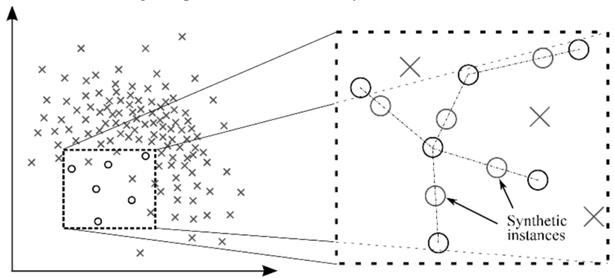
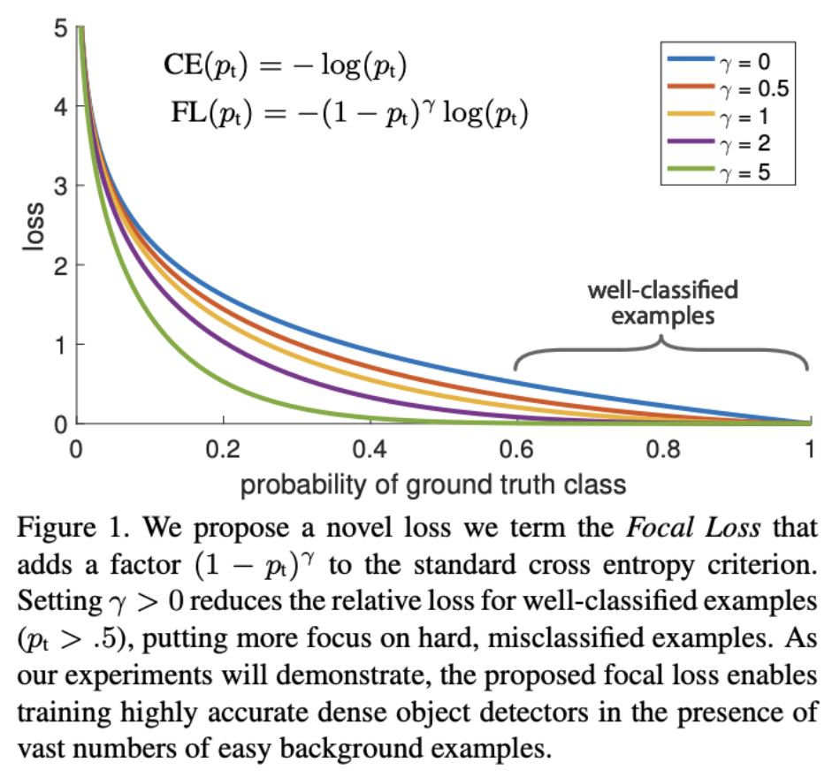

* TOC
{:toc}

## ML in research vs production: misalignment of interests
* objective: state-of-the-art (SOTA) at the cost of complexity: e.g. ensembling is popular to win competitions but increases complexity
* **risks of complexity**: more error-prone to deploy, slower to serve, harder to interpret (interpretability: allows you to detect biases and debug a model)
* benchmarks incentivize accuracy at the expense of compactness, fairness, energy efficiency, interpretability
* research prioritizes **fast training** (high throughput), production prioritizes **fast inference** (low latency)
* in research/competition, not enough time spent working on the data:
  * Real-life data is streaming, shifting, sparse, imbalanced, incorrect, private, biased...
  * applications developed with the most/best data win.

In 2009, Google showed increasing web search latency 100 to 400 ms reduces daily number of searches per user by 0.2% to 0.6%.
In 2019, Booking.com found increasing latency by 30% in latency costs about 0.5% in conversion rates.

Majority of ML-related jobs are in productionizing ML as off-the-shelf models become more accessible and the "bigger, better" approach the research community is taking requires short-term business applications ($10+M in compute alone).

## Challenges in ML production
* Data testing: is sample useful?
* Data and model versioning: see [DVC](https://github.com/iterative/dvc)
* Monitoring for data-drift: see [Dessa](https://www.dessa.com/) (acquired by Square)
* Data labeling: see [Snorkel](https://www.snorkel.org/)
* CI/CD test: see [Argo](https://argoproj.github.io/)
* Deployment: see [OctoML](https://octoml.ai/)
* Model compression (e.g. to fit onto consumer devices): see [Xnor.ai](#), acquired by Apple for ~$200M.
* Inference optimization: speed up inference time by fusing operations together, using lower precision, making a model smaller. See [TensorRT](https://developer.nvidia.com/tensorrt)
* Edge device: Hardware designed to run ML algorithms fast and cheap. Example: [Coral SOM](https://coral.ai/products/som/)
* Privacy: GDPR-compliant (General Data Protection Regulation)? See [PySyft](https://github.com/OpenMined/PySyft)
* Data manipulation: see [Dask](https://github.com/dask/dask) (parallel computation in Python, mimicking pandas)
* Data format: row-based data formats like CSV require to load all features even if using a subset of them. Columnar file formats like PARQUET and ORC are optimized for that use case.

## ML systems design
Defining interface, algorithms, data, infrastructure and hardware.

Many cloud services enable autoscaling the number of machines depending on usage.

Subject matter experts (auditors, bankers, doctors, lawyers etc...) are overlooked developers of ML systems. We only think of them to label data but they are useful for: problem formulation, model evaluation, developping user interface...

### Online prediction (a.k.a. HTTP prediction) vs batch prediction
* **batch prediction**:
  * asynchronous
  * periodical
  * high throughput
  * processing accumulated data when you don’t need immediate results (e.g. recommendation systems)
* **online prediction**: instantaneous (e.g. autocomplete)

**Batch prediction is a workaround for when online prediction isn’t cheap enough or isn’t fast enough**

Without batching, higher latency means lower throughput. With batching, higher throughput means higher latency.

### Edge computing vs cloud computing
Edge computing: computation done on the edge (= on device) as opposed to cloud computing (on servers).

Cloud computing is used when ML model requires too much compute and memory to be run on device.

Disadvantages of cloud computing:
* network latency is a bigger bottleneck than inference latency.
* storing data of many users in the same place means a breach can affect many people
* servers are costly

**The future of ML is online and on-device** (+ see federated learning for training over edge devices).

### Online learning vs offline learning
Data becomes available sequentially vs in batch. E.g. Ordinary Least Squares vs Recursive Least Squares.

## Iterative process
Cycle with 6 steps:
1. Project scoping (goals, evaluation criteria):
- multiple goals: loss = linear combination of multiple losses or model = linear combination of multiple models (don't need to retrain when tweaking coefficients)
- see [Pareto-Based Multiobjective Machine Learning](http://citeseerx.ist.psu.edu/viewdoc/download?doi=10.1.1.157.2352&rep=rep1&type=pdf)
- balance when decoupling objectives (common processing is good, coupling is bad), see multi-task learning
2. Data management (processing, control, storage)
3. ML Engineering
4. Deployment
5. Monitoring and maintenance
6. Data Science (evaluate model performance against goals, generate business insights)

## Case studies
* [Using Machine Learning to Predict Value of Homes On Airbnb](https://medium.com/airbnb-engineering/using-machine-learning-to-predict-value-of-homes-on-airbnb-9272d3d4739d)
* [Using Machine Learning to Improve Streaming Quality at Netflix](https://medium.com/netflix-techblog/using-machine-learning-to-improve-streaming-quality-at-netflix-9651263ef09f)
* [150 Successful Machine Learning Models: 6 Lessons Learned at Booking.com](https://blog.acolyer.org/2019/10/07/150-successful-machine-learning-models/)
* [How we grew from 0 to 4 million women on our fashion app, with a vertical machine learning approach](https://medium.com/hackernoon/how-we-grew-from-0-to-4-million-women-on-our-fashion-app-with-a-vertical-machine-learning-approach-f8b7fc0a89d7)
* [Machine Learning-Powered Search Ranking of Airbnb Experiences](https://medium.com/airbnb-engineering/machine-learning-powered-search-ranking-of-airbnb-experiences-110b4b1a0789)
* [From shallow to deep learning in fraud](https://eng.lyft.com/from-shallow-to-deep-learning-in-fraud-9dafcbcef743)
* [Space, Time and Groceries](https://tech.instacart.com/space-time-and-groceries-a315925acf3a)
* [Creating a Modern OCR Pipeline Using Computer Vision and Deep Learning](https://blogs.dropbox.com/tech/2017/04/creating-a-modern-ocr-pipeline-using-computer-vision-and-deep-learning/)
* [Scaling Machine Learning at Uber with Michelangelo](https://eng.uber.com/scaling-michelangelo/)
* [Spotify’s Discover Weekly: How machine learning finds your new music](https://hackernoon.com/spotifys-discover-weekly-how-machine-learning-finds-your-new-music-19a41ab76efe)

# Data Engineering
Better algorithms vs more data:
* Judea Pearl warns of the data-centric paradigm
* structure allows us to design systems that can learn more from less data (see [Deep Learning and Innate Priors video](https://www.youtube.com/watch?v=fKk9KhGRBdI&feature=emb_logo&ab_channel=StanfordAISalon))
* Other side: [More data usually beats better algorithms](https://anand.typepad.com/datawocky/2008/03/more-data-usual.html)
* [The Bitter Lesson](http://www.incompleteideas.net/IncIdeas/BitterLesson.html) (Richard Sutton)
* [The Unreasonable Effectiveness of Data](https://static.googleusercontent.com/media/research.google.com/en//pubs/archive/35179.pdf)

## Sources
* First party data: data you collect about your own customers
* Second party data: data that someone else collects about their customers
* Third party data: data that someone else collects about the general public

## Formats
**Row-based is best to access samples, continuously write transactions. Column-based is best to access features.**

Examples of formats:
json, csv (row-based, access samples), parquet (column-based, access features; Hadoop, Amazon Redshift), avro (Hadoop), protobuf (TensorFlow), pickle (python, PyTorch)

CSV is text, Parquet is binary (more compact, but not human readable)

Pandas is column-based, whereas NumPy is row-based. Accessing a row in pandas is slower than in NumPy and it's the opposite for columns. See [just-pandas-things](https://github.com/chiphuyen/just-pandas-things/blob/master/just-pandas-things.ipynb)

OLTP (OnLine Transaction Processing) vs. OLAP (OnLine Analytical Processing) databases.

A repository for storing structured data (processed) is called a *data warehouse*. A repository for storing unstructured data (raw) is called a *data lake*.

Stream storage: Apache Kafka, Amazon Kinesis.\
Stream processing: Apache Flink.

**Having two different pipelines to process data is a common cause for bugs in ML production.**

Readings:
* [Uber’s Big Data Platform: 100+ Petabytes with Minute Latency](https://eng.uber.com/uber-big-data-platform/)
* [Keystone Real-time Stream Processing Platform](https://netflixtechblog.com/keystone-real-time-stream-processing-platform-a3ee651812a)
* [A Beginner’s Guide to Data Engineering](https://medium.com/@rchang/a-beginners-guide-to-data-engineering-part-i-4227c5c457d7)

## Learning with noisy labels
Data lineage: track where data/label comes from

* [Learning with Noisy Labels](https://www.cs.cmu.edu/~pradeepr/paperz/learning_nl_nips.pdf)
* [Loss factorization, weakly supervised learning and label noise robustness](https://arxiv.org/abs/1602.02450)
* [Cost-Sensitive Learning with Noisy Labels](https://jmlr.csail.mit.edu/papers/volume18/15-226/15-226.pdf)
* [Confident Learning: Estimating Uncertainty in Dataset Labels](https://arxiv.org/pdf/1911.00068.pdf)

## Weak supervision
Programmatic labeling, alternative to hand labeling (expensive, linear in number of samples, non private)

* [weak supervision](https://ai.stanford.edu/blog/weak-supervision/)
* [snorkel](https://www.snorkel.org/)
* [Snorkel: Rapid Training Data Creation with Weak Supervision](https://arxiv.org/abs/1711.10160)

## Transfer Learning
zero-shot (no example, no gradient update) vs few-shot (few examples as input, no gradient updates) vs fine-tuning

## Active Learning
Model queries labels that are most helpful to its learning. See [Active Learning Litterature Survey](http://burrsettles.com/pub/settles.activelearning.pdf)

# Model development and training - part I
## Sampling
Samples of real world data. Two families: *non-probability sampling* and *random sampling*.

### Random sampling
#### Simple random sample (SRS)
Each sample has equal probability of being selected. Con: rare class is undersampled.

#### Stratified sampling
Divide population into groups (strata) and sample a certain percentage from each group. Challenging for multilabel class.

#### Weighted sampling
Each sample is given a probability of being selected. Embed subject matter expertise.

Different from sample weights: sample weights are used to weight samples in the training loss, after being selected.

#### Importance sampling
See [Stanford CS228 Lecture Notes](timothydelille.github.io/content/stanford_cs228_probabilistic_graphical_modeling.html#importance-sampling.html).

#### Reservoir sampling
Imagine you have to sample $$k$$ tweets from an incoming stream of tweets with constraints:
* you don't know how many tweets there are
* you can't fit them all in memory
* you want every tweet to have equal probability of being selected

Solution:
* first $$k$$ elements are put in the reservoir
* for each incoming $$i$$-th element, generate random number $$j$$ between $$1$$ and $$i$$.
* if $$1 \leq j \leq k$$, replace $$j$$-th element in reservoir with $$i$$-th

Each incoming $$i$$-th has probability $$k/i$$ of being put in the reservoir and has a probability of $$(1/k)$$ of being placed at any position, given that it was sampled$$.
Let's say there are $$n$$ elements in total (we don't know $$n$$). The probability of the $$i$$-th element of being put in the reservoir and staying in there (thus, in effect, probability of being sampled) once the stream has finished running is:

$$k/i\times(1-k/(i+1)*1/k)\times\dots\times(1-k/n*1/k)$$

$$= (k\times(i+1-1)\times\dots\times(n-1))/(i\times(i+1)\times\dots\times n)$$

$$= \frac{k\times !(n-1)/!(i-1)} {!n/!(i-1)} = k/n$$

Each item in the population has equal probability $$k/n$$ of being sampled.

### Non-probability sampling
See [personal notes](#)

No probability rule for selecting a sample. Not representative of real world data and embedded with **selection bias**:
* convenience sampling: (based on what is available, popular because convenient)
* snowball sampling: future samples based on existing samples
* judgment sampling: experts decide which sample to include
* quota sampling: select sample based on quotas

## Class imbalance
Insufficient signal for minority class (effectively becomes few shot learning). Trivial solution (always predict majority class) can have high accuracy but is of no use.

### Solutions
Note: some argue that you should not try to fix class imbalance if that's how the data is in the real world. Why?
#### Resampling

**Undersampling: Tomek links**

Find pairs of samples from opposite class that are close and rome the majority class. Clear decision boundary but possible under-fitting:

**Oversampling: SMOTE (Synthetic Minority Oversampling TEchnique)**

Sample convex (=linear) combinations of existing data points within the minority class.

**Oversampling: Data augmentation**

For CV: random cropping, flipping, erasing, etc...

Mixup (for speech and tabular data): mix X% of class A and Y% of class B. Incentivizes model to learn linear relationsips (assumption is that linear behavior reduces variance outside training set)

#### Loss adjustment: weight balancing
**Biasing towards rare class**
* Naive version: weigth is inversely proportional to cardinality of the class
* More sophisticated version: [Balanced Loss Based on Effective Number of Samples](https://openaccess.thecvf.com/content_CVPR_2019/papers/Cui_Class-Balanced_Loss_Based_on_Effective_Number_of_Samples_CVPR_2019_paper.pdf)

**Biasing towards difficult samples**

See [Focal Loss](https://arxiv.org/abs/1708.02002)

#### Algorithms
Ensembling methods such as boosting and bagging, together with resampling, perform well on imbalanced datasets.

Papers:
* [A Review on Ensembles for the Class Imbalance Problem: Bagging-, Boosting-, and Hybrid-Based Approaches](https://sci2s.ugr.es/keel/pdf/algorithm/articulo/2011-IEEE%20TSMC%20partC-%20GalarFdezBarrenecheaBustinceHerrera.pdf)
* [Solving class imbalance problem using bagging, boosting techniques, with and without using noise filtering method](https://content.iospress.com/articles/international-journal-of-hybrid-intelligent-systems/his190261)

**Bagging (bootstrap aggregating)**

Sample bootstraps with replacement and learn one model per bootstrap. If classification, final prediction is majority vote. If regression, final prediction is average.

Reduces variance (=prevents overfitting)

**Boosting**

Iteratively combine weak learners.

See:
* Adaboost (reweight samples and learners based on performance)
* [Gradient Boosting Machine](timothydelille.github.io/content/gradient_boosting.html) (gradient descent in function space)
* XGBoost (variant of Gradient Boosting Machine): used to be algorithm of choice for winning competitions
* LightGBM: dethroned XGBoost in competitions. Faster training for similar accuracy.
